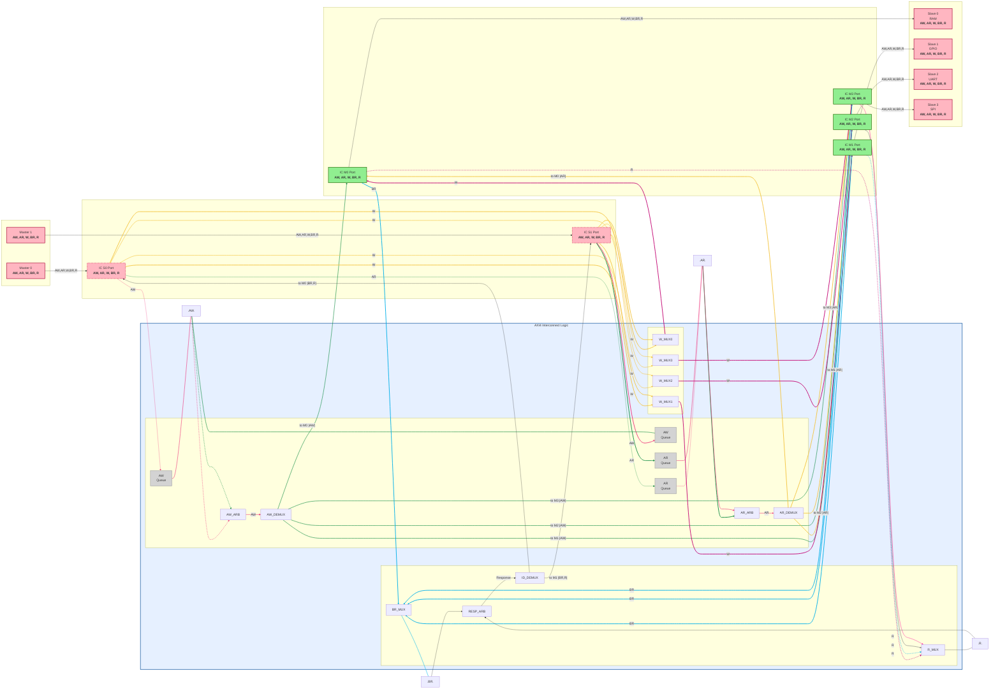

# AXI4 System Suite

## 📋 Tổng Quan Dự Án

**AXI4 System Suite** là một hệ thống SoC (System-on-Chip) tích hợp các bộ xử lý RISC-V kết nối với các thiết bị ngoại vi thông qua AXI4 Interconnect. Dự án cung cấp một nền tảng hoàn chỉnh để phát triển, mô phỏng, kiểm thử và triển khai các hệ thống nhúng dựa trên RISC-V và AXI4.

### 🎯 Tính Năng Chính

- **AXI4 Interconnect**: Hỗ trợ 2 Master × 4 Slave với các thuật toán arbitration (Fixed Priority, Round-Robin, QoS-based)
- **RISC-V Cores**: Tích hợp nhiều loại RISC-V cores:
  - SERV (bit-serial architecture)
  - fRISC-V
  - 5-stage Pipeline RISC-V
- **AXI Bridges**: Chuyển đổi giữa Wishbone và AXI4 protocols
- **Peripherals**: RAM, GPIO, UART, SPI (AXI-Lite)
- **Verification**: Testbenches đầy đủ cho từng module và hệ thống
- **Simulation**: Hỗ trợ ModelSim, Quartus, và Verilator
- **FPGA Deployment**: Hỗ trợ triển khai lên FPGA (Xilinx KV260)

### 🏗️ Kiến Trúc Hệ Thống

Hệ thống điển hình bao gồm:
- **2 RISC-V Cores** (SERV) với Instruction Bus và Data Bus riêng biệt
- **AXI Master Aggregators** để gộp các bus từ mỗi core
- **AXI Interconnect** (2M × 4S) với Round-Robin arbitration
- **4 Slaves**: RAM, GPIO, UART, SPI

```
┌─────────────┐         ┌─────────────┐
│ SERV Core 0 │         │ SERV Core 1 │
└──────┬──────┘         └──────┬──────┘
       │                       │
       │ AXI Wrappers          │ AXI Wrappers
       ▼                       ▼
┌─────────────────────────────────────┐
│     AXI Interconnect (2M × 4S)      │
│      Round-Robin Arbitration        │
└──────┬──────┬──────┬──────┬─────────┘
       │      │      │      │
       ▼      ▼      ▼      ▼
    ┌────┐ ┌────┐ ┌────┐ ┌────┐
    │RAM │ │GPIO│ │UART│ │SPI │
    └────┘ └────┘ └────┘ └────┘
```

### 🔌 AXI Interconnect Architecture với Channel Controllers

Hệ thống AXI Interconnect sử dụng **4 Channel Controllers** chuyên biệt để điều khiển từng AXI channel:

```
                    ┌─────────────────┐         ┌─────────────────┐
                    │   Master 0      │         │   Master 1      │
                    │  (Compute)      │         │  (Dependency)   │
                    │                 │         │                 │
                    │  AW  AR  W      │         │  AW  AR  W      │
                    │  BR  R          │         │  BR  R          │
                    └─────┬───┬───┬───┘         └─────┬───┬───┬───┘
                          │   │   │                   │   │   │
                          │   │   │                   │   │   │
        ┌─────────────────▼───▼───▼───────────────────▼───▼───▼─────┐
        │                                                           │
        │              AXI INTERCONNECT (2M × 4S)                   │
        │                                                           │
        │  ┌──────────────┐              ┌──────────────┐          │
        │  │ IC S0 Port   │              │ IC S1 Port   │          │
        │  │ (Master 0)   │              │ (Master 1)   │          │
        │  │              │              │              │          │
        │  │ AW  AR  W    │              │ AW  AR  W    │          │
        │  │ BR  R        │              │ BR  R        │          │
        │  └───┬───┬───┬──┘              └───┬───┬───┬──┘          │
        │      │   │   │                     │   │   │             │
        │      │   │   │                     │   │   │             │
        │  ┌───▼───▼───▼─────────────────────▼───▼───▼───┐        │
        │  │         AW_Channel_Controller                │        │
        │  │  • Arbitration (Round-Robin)                 │        │
        │  │  • Address Decoder (S0-S3)                   │        │
        │  └───────────────┬──────────────────────────────┘        │
        │                  │                                       │
        │  ┌───────────────▼──────────────────────────────┐        │
        │  │         AR_Channel_Controller                │        │
        │  │  • Arbitration (Round-Robin)                 │        │
        │  │  • Address Decoder (S0-S3)                   │        │
        │  └───────────────┬──────────────────────────────┘        │
        │                  │                                       │
        │  ┌───────────────▼──────────────────────────────┐        │
        │  │         WD_Channel_Controller                │        │
        │  │  • Data Demux (1→4)                         │        │
        │  │  • Write Data Routing                       │        │
        │  └───────────────┬──────────────────────────────┘        │
        │                  │                                       │
        │  ┌───────────────▼──────────────────────────────┐        │
        │  │         Read Data Channel                    │        │
        │  │  • Data Mux (4→1)                           │        │
        │  │  • Read Data Routing                        │        │
        │  └───────────────┬──────────────────────────────┘        │
        │                  │                                       │
        │  ┌───────────────▼──────────────────────────────┐        │
        │  │         BR_Channel_Controller                │        │
        │  │  • Response Arbiter                          │        │
        │  │  • Response Mux (4→1)                        │        │
        │  │  • BID Matcher                               │        │
        │  └───────────────┬──────────────────────────────┘        │
        │                  │                                       │
        │  ┌───────────────┼───────────┬───────────┬───────────┐  │
        │  │ IC M0 Port    │ IC M1 Port│ IC M2 Port│ IC M3 Port│  │
        │  │ (Slave 0)     │ (Slave 1) │ (Slave 2) │ (Slave 3) │  │
        │  │               │           │           │           │  │
        │  │ AW  AR  W     │ AW  AR  W │ AW  AR  W │ AW  AR  W │  │
        │  │ BR  R         │ BR  R     │ BR  R     │ BR  R     │  │
        │  └───────┬───────┴───────┬───┴───────┬───┴───────┬───┘  │
        └──────────┼───────────────┼───────────┼───────────┼──────┘
                   │               │           │           │
        ┌──────────▼───────┐ ┌─────▼─────┐ ┌──▼─────┐ ┌───▼──────┐
        │   Slave 0: RAM   │ │Slave 1:   │ │Slave 2:│ │Slave 3:  │
        │                  │ │  GPIO     │ │  UART  │ │   SPI    │
        │  0x00000000      │ │           │ │        │ │          │
        │  - 0x1FFFFFFF    │ │0x40000000 │ │0x800000│ │0xC0000000│
        │                  │ │-0x5FFFFF  │ │-0x9FFF │ │-0xDFFFFFF│
        │  AW  AR  W       │ │           │ │        │ │          │
        │  BR  R           │ │ AW  AR  W │ │AW AR W │ │AW AR W   │
        └──────────────────┘ │ BR  R     │ │BR R    │ │BR R      │
                             └───────────┘ └────────┘ └──────────┘

Legend:
  AW = Write Address Channel    AR = Read Address Channel
  W  = Write Data Channel       R  = Read Data Channel
  BR = Write Response Channel
```

#### Sơ Đồ Chi Tiết với Mermaid (Datapath)



**Channel Controllers được sử dụng:**
1. **AW_Channel_Controller_Top**: Điều khiển Write Address Channel
   - Arbitration giữa các masters
   - Address decoding để chọn slave
   - Handshake protocol control

2. **WD_Channel_Controller_Top**: Điều khiển Write Data Channel
   - Routing write data từ master đến slave đã chọn
   - Demultiplexer 1→4 để route data đến đúng slave
   - Write data handshake management

3. **BR_Channel_Controller_Top**: Điều khiển Write Response Channel
   - Arbitration cho write responses từ slaves
   - Multiplexer 4→1 để route response về đúng master
   - Response ID matching

4. **AR_Channel_Controller_Top**: Điều khiển Read Address Channel
   - Arbitration giữa các masters
   - Address decoding để chọn slave
   - Handshake protocol control

---

## 📂 Cấu Trúc Thư Mục

```
axi4-system-suite/
│
├── src/                          # Source code RTL
│   ├── axi_bridge/              # AXI bridges và wrappers
│   │   ├── serv_axi_wrapper.v
│   │   ├── friscv_axi_wrapper.v
│   │   └── riscv_pipeline_axi_wrapper.v
│   │
│   ├── axi_interconnect/        # AXI Interconnect core
│   │   ├── rtl/
│   │   │   ├── core/            # Core modules (Interconnect, Aggregator)
│   │   │   ├── arbitration/     # Arbitration algorithms
│   │   │   ├── channel_controllers/  # Read/Write channel controllers
│   │   │   ├── datapath/        # Mux/Demux modules
│   │   │   ├── decoders/        # Address decoders
│   │   │   ├── buffers/         # FIFO buffers
│   │   │   ├── handshake/       # Handshake modules
│   │   │   └── utils/           # Utility modules
│   │   └── SystemVerilog/       # SystemVerilog implementations
│   │
│   ├── axi_full/                # AXI4 Full interface modules
│   ├── axi_stream/              # AXI Stream modules
│   │
│   ├── cores/                   # RISC-V processor cores
│   │   ├── serv/                # SERV RISC-V core
│   │   ├── friscv/              # fRISC-V core
│   │   └── riscv-5stage-pipeline/  # 5-stage pipeline RISC-V
│   │
│   ├── peripherals/             # Peripheral modules
│   │   └── axi_lite/            # AXI-Lite peripherals
│   │       ├── axi_lite_ram.v
│   │       ├── axi_lite_gpio.v
│   │       ├── axi_lite_uart.v
│   │       └── axi_lite_spi.v
│   │
│   └── systems/                 # Top-level system modules
│       ├── dual_serv_axi_system.v
│       ├── dual_pipeline_serv_axi_system.v
│       └── dual_axi_shell.v
│
├── verification/                # Verification và testbenches
│   ├── testbenches/             # Testbench modules
│   │   ├── interconnect_tb/     # AXI Interconnect testbenches
│   │   ├── system_tb/           # System-level testbenches
│   │   ├── bridge_tb/           # Bridge testbenches
│   │   ├── dual_master_tb/      # Dual master testbenches
│   │   └── simple_*_tb/         # Simple testbenches
│   │
│   ├── programs/                # Test programs (hex files)
│   │   ├── dual_core_test.hex
│   │   ├── comprehensive_test.hex
│   │   └── ...
│   │
│   ├── testcases/               # Test case scripts
│   ├── coverage/                # Coverage reports
│   └── formal/                  # Formal verification
│
├── sim/                         # Simulation files
│   ├── modelsim/                # ModelSim simulation
│   │   ├── compile_*.tcl        # Compilation scripts
│   │   ├── simulate_*.tcl       # Simulation scripts
│   │   └── wave_*.do            # Waveform scripts
│   │
│   ├── quartus/                 # Quartus simulation
│   │   └── AXI_PROJECT.qws
│   │
│   ├── verilator/               # Verilator simulation
│   │   ├── compile_verilator.sh
│   │   ├── run_simulation.sh
│   │   └── INSTALL_GUIDE.md
│   │
│   ├── logs/                    # Simulation logs
│   └── waveforms/               # Waveform files
│
├── synthesis/                   # Synthesis scripts và outputs
│   ├── scripts/
│   │   ├── quartus/             # Quartus synthesis scripts
│   │   ├── vivado/              # Vivado synthesis scripts
│   │   └── synplify/            # Synplify synthesis scripts
│   │
│   ├── constraints/             # Timing constraints
│   ├── netlists/                # Synthesized netlists
│   └── reports/                 # Synthesis reports
│
├── deployment/                  # FPGA deployment
│   └── boards/                  # Board-specific configurations
│       └── kv260/               # Xilinx Kria KV260
│           ├── scripts/         # Build scripts
│           ├── constraints/     # Pin constraints
│           ├── bitstreams/      # Generated bitstreams
│           ├── reports/         # Implementation reports
│           └── logs/            # Build logs
│
├── software/                    # Embedded software
│   ├── applications/            # User applications
│   ├── drivers/                 # Device drivers
│   │   ├── baremetal/           # Bare-metal drivers
│   │   └── linux/               # Linux kernel drivers
│   └── scripts/                 # Build scripts
│
├── docs/                        # Documentation
│   ├── architecture/            # Architecture documentation
│   │   ├── DUAL_RISCV_2M4S_HARDWARE_ARCHITECTURE.md
│   │   └── SYSTEM_ARCHITECTURE.png
│   │
│   ├── user_guides/             # User guides
│   ├── specifications/          # Technical specifications
│   ├── design_notes/            # Design notes
│   ├── api_reference/           # API reference
│   └── changelog/               # Change logs
│
├── tools/                       # Utilities và tools
│   ├── scripts/                 # Helper scripts
│   ├── lint/                    # Linting tools
│   └── utilities/               # Utility programs
│
├── build/                       # Build artifacts
│   ├── cache/
│   ├── obj/
│   └── work/
│
└── Test/                        # Test files
    └── test*.md
```

---

## 🚀 Bắt Đầu Nhanh

### Yêu Cầu

- **Simulation Tools**: ModelSim/QuestaSim, Quartus, hoặc Verilator
- **Synthesis Tools**: Quartus (Intel) hoặc Vivado (Xilinx)
- **RISC-V Toolchain**: Để compile software (nếu cần)

### Chạy Comprehensive Testbench

#### ModelSim:
```bash
cd sim/modelsim
vsim -do run_comprehensive_tb_simple.tcl
```

#### Vivado:
```bash
# Từ Vivado TCL console:
source synthesis/scripts/vivado/run_comprehensive_tb.tcl

# Hoặc từ GUI:
# 1. Mở project
# 2. Set top module: comprehensive_system_tb
# 3. Run Simulation với runtime: 11000ns
```

#### Verilator:
```bash
cd sim/verilator
./compile_verilator.sh
./run_simulation.sh
```

### Synthesis

#### Quartus:
```bash
cd synthesis/scripts/quartus
# Chạy synthesis script
```

#### Vivado:
```bash
cd synthesis/scripts/vivado
# Chạy synthesis script
```

### FPGA Deployment

#### KV260:
```bash
cd deployment/boards/kv260
# Xem README.md trong thư mục này
```

---

## 📚 Tài Liệu

- **Kiến trúc hệ thống**: Xem `docs/architecture/`
- **Hướng dẫn sử dụng**: Xem `docs/user_guides/`
- **API Reference**: Xem `docs/api_reference/`
- **Tài liệu tổng hợp**: Xem `docs/README.md`

---

## 🔧 Các Module Chính

### AXI Interconnect
- **Location**: `SystemVerilog/axi_interconnect/core/`
- **Top Module**: `AXI_Interconnect.sv` (wrapper) → `AXI_Interconnect_Full.sv`
- **Features**:
  - 2 Master × 4 Slave configuration
  - Multiple arbitration modes (Fixed Priority, Round-Robin, QoS-based)
  - Full AXI4 Read/Write support
  - Address decoding và routing
  - **Channel Controllers** cho từng AXI channel

### Channel Controllers (Core Components)

Hệ thống sử dụng **4 Channel Controllers** chuyên biệt:

1. **AW_Channel_Controller_Top** (Write Address Channel)
   - **Location**: `SystemVerilog/axi_interconnect/channel_controllers/write/AW_Channel_Controller_Top.sv`
   - **Chức năng**:
     - Arbitration giữa Master 0 và Master 1 cho write address
     - Address decoding để xác định slave đích (S0, S1, S2, S3)
     - Handshake protocol control (AWVALID/AWREADY)
     - Integration với QoS Arbiter

2. **WD_Channel_Controller_Top** (Write Data Channel)
   - **Location**: `SystemVerilog/axi_interconnect/channel_controllers/write/WD_Channel_Controller_Top.sv`
   - **Chức năng**:
     - Routing write data từ master đã được grant đến slave đã chọn
     - Demultiplexer 1→4 để route data đến đúng slave
     - Write data handshake management (WVALID/WREADY/WLAST)
     - Synchronization với AW channel controller

3. **BR_Channel_Controller_Top** (Write Response Channel)
   - **Location**: `SystemVerilog/axi_interconnect/channel_controllers/write/BR_Channel_Controller_Top.sv`
   - **Chức năng**:
     - Arbitration cho write responses từ 4 slaves
     - Multiplexer 4→1 để route response về đúng master
     - Response ID matching (BID) để đảm bảo response về đúng master
     - Write response handshake (BVALID/BREADY)

4. **AR_Channel_Controller_Top** (Read Address Channel)
   - **Location**: `SystemVerilog/axi_interconnect/channel_controllers/read/AR_Channel_Controller_Top.sv`
   - **Chức năng**:
     - Arbitration giữa Master 0 và Master 1 cho read address
     - Address decoding để xác định slave đích
     - Handshake protocol control (ARVALID/ARREADY)
     - Integration với QoS Arbiter

**Cấu trúc sử dụng:**
```
comprehensive_system_tb.sv
    │
    └──> AXI_Interconnect (wrapper)
            │
            └──> AXI_Interconnect_Full
                    │
                    ├──> AW_Channel_Controller_Top  ✅
                    ├──> WD_Channel_Controller_Top  ✅
                    ├──> BR_Channel_Controller_Top  ✅
                    └──> AR_Channel_Controller_Top  ✅
```

### RISC-V Cores
- **SERV**: `src/cores/serv/` - Bit-serial RISC-V implementation
- **fRISC-V**: `src/cores/friscv/`
- **5-stage Pipeline**: `src/cores/riscv-5stage-pipeline/`

### AXI Bridges
- **Location**: `src/axi_bridge/`
- Chuyển đổi Wishbone → AXI4 cho các RISC-V cores

### Peripherals
- **RAM**: `src/peripherals/axi_lite/axi_lite_ram.v`
- **GPIO**: `src/peripherals/axi_lite/axi_lite_gpio.v`
- **UART**: `src/peripherals/axi_lite/axi_lite_uart.v`
- **SPI**: `src/peripherals/axi_lite/axi_lite_spi.v`

---

## 🧪 Verification

### Comprehensive System Testbench

**Testbench**: `SystemVerilog/testbenches/axi_masters/comprehensive_system_tb.sv`

Dự án bao gồm comprehensive testbench với **21 test cases** đã được verify thành công:

#### Tổng Kết Kết Quả Verification

```
============================================================================
Test Statistics
============================================================================
Test Scenarios:  8
Total Test Cases: 21
Passed:           21
Failed:           0
Pass Rate:        100.0%
============================================================================
```

#### Chi Tiết Test Cases

**Test 1: Basic Sequential Operations** ✅
- M0 sequential operation: **PASS**
- M1 sequential operation: **PASS**

**Test 2: Concurrent Operations - Different Slaves** ✅
- Concurrent different slaves: **PASS**

**Test 3: Contention - Same Slave (S0)** ✅
- Contention same slave: **PASS**

**Test 4: Busy Flag Monitoring** ✅
- Initial idle state: **PASS**
- M0 busy after start: **PASS**
- M1 idle when M0 busy: **PASS**
- M0 idle after complete: **PASS**
- M1 busy after start: **PASS**
- M1 idle after complete: **PASS**

**Test 5: All Slaves Coverage (S2-UART, S3-SPI)** ✅
- S0 (RAM) accessible: **PASS**
- S2 base address correct: **PASS**
- S3 base address correct: **PASS**
- All 4 slaves configured: **PASS**

**Test 6: Multiple Concurrent Transactions** ✅
- M0 completed in concurrent mode: **PASS**
- M1 completed in concurrent mode: **PASS**
- Both masters completed concurrently: **PASS**

**Test 7: Stress Test - Rapid Sequential Requests** ✅
- Stress test: all rapid requests completed: **PASS**
- Completed 5/5 rapid requests

**Test 8: Arbitration Fairness** ✅
- M0 completed first in contention: **PASS**
- M1 completed after M0: **PASS**
- Arbitration handled contention correctly: **PASS**

#### Channel Controllers Verification

Tất cả **4 Channel Controllers** đã được verify hoạt động đúng:

- ✅ **AW_Channel_Controller_Top**: Write address arbitration và routing hoạt động chính xác
- ✅ **WD_Channel_Controller_Top**: Write data routing và demux hoạt động đúng
- ✅ **BR_Channel_Controller_Top**: Write response arbitration và mux hoạt động chính xác
- ✅ **AR_Channel_Controller_Top**: Read address arbitration và routing hoạt động đúng

#### Simulation Performance

- **Total Simulation Time**: 4675ns
- **Timeout Setting**: 10000ns
- **Completion**: Simulation hoàn thành trước timeout
- **Status**: ✅ **SUCCESS**

#### Các Vấn Đề Đã Được Khắc Phục

1. ✅ **M1 Timeout Issue**: Đã sửa address offset calculation trong `axi_master_1.sv`
2. ✅ **Arbitration Deadlock**: Đã sửa `Token` assignment và `Request` logic trong `Qos_Arbiter`
3. ✅ **Handshake Deadlock**: Đã sửa `AW_HandShake_Checker` và `WR_HandShake` logic
4. ✅ **Write Response Routing**: Đã sửa `M01_AXI_BID` connection trong `AXI_Interconnect.sv`
5. ✅ **ModelSim Compatibility**: Đã điều chỉnh SystemVerilog syntax cho ModelSim ALTERA

#### Kết Luận

Hệ thống AXI Interconnect với **4 Channel Controllers** đã được verify thành công với **100% test cases passed**. Tất cả các chức năng chính hoạt động đúng:
- ✅ Write Address Channel (AW_Channel_Controller_Top)
- ✅ Write Data Channel (WD_Channel_Controller_Top)
- ✅ Write Response Channel (BR_Channel_Controller_Top)
- ✅ Read Address Channel (AR_Channel_Controller_Top)
- ✅ Read Data Channel (Mux 4→1)
- ✅ Arbitration (Round-Robin/QoS-based)
- ✅ Address Decoding
- ✅ Handshake Protocols
- ✅ Concurrent Transactions
- ✅ Contention Handling

**Testbench Location**: `SystemVerilog/testbenches/axi_masters/comprehensive_system_tb.sv`

Xem `verification/testbenches/` để biết thêm chi tiết về các testbenches khác.

---

## 📝 License

Xem LICENSE file trong từng module để biết thông tin license cụ thể.

---

## 🤝 Đóng Góp

Dự án này đang trong quá trình phát triển. Mọi đóng góp đều được chào đón!

---

## 📞 Liên Hệ

Để biết thêm thông tin, vui lòng xem tài liệu trong thư mục `docs/`.

---

**Last Updated**: 2025-01-XX  
**Verification Status**: ✅ **100% PASS (21/21 test cases)**  
**Channel Controllers**: ✅ **All 4 Controllers Verified**


