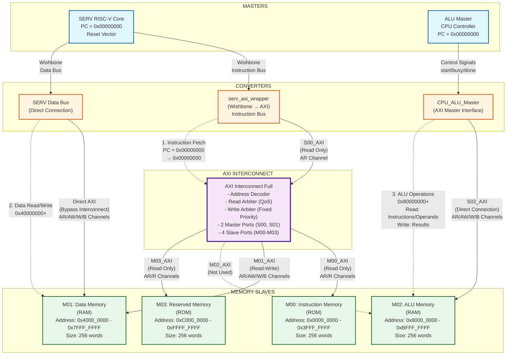
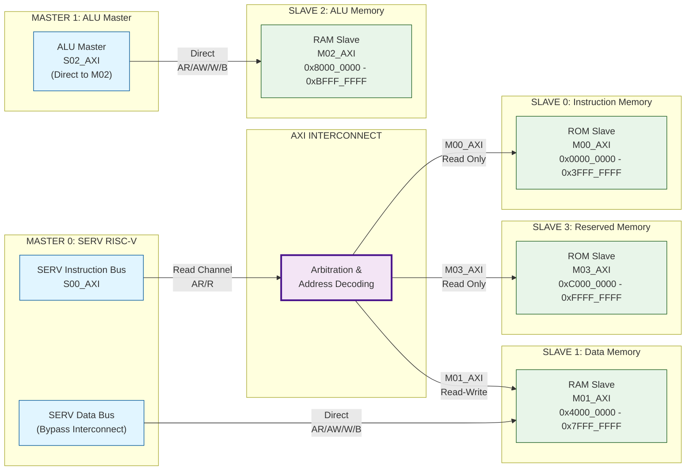
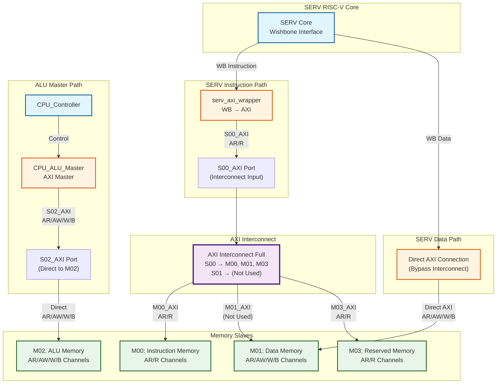

# Kiến Trúc Dual Master System - 2 Masters & 4 Slaves

> **Hướng dẫn export sang JPG:**
> 1. Sử dụng Mermaid Live Editor: https://mermaid.live/
> 2. Copy diagram vào editor
> 3. Click "Actions" -> "Download PNG" hoặc "Download SVG"
> 4. Convert PNG sang JPG nếu cần

---

## Diagram Tổng Quát - Kiến Trúc Hệ Thống



---

## Diagram Chi Tiết - Luồng Dữ Liệu AXI



---

## Diagram Kết Nối AXI Channels



---

## Bảng Tóm Tắt Kết Nối

| Master | Bus Type | Interconnect Port | Target Slave | Address Range | Operation |
|--------|----------|-------------------|--------------|--------------|-----------|
| SERV | Instruction | S00_AXI | M00 (Instruction Memory) | 0x0000_0000 - 0x3FFF_FFFF | Read Only |
| SERV | Data | Direct (Bypass) | M01 (Data Memory) | 0x4000_0000 - 0x7FFF_FFFF | Read/Write |
| ALU Master | ALU | S02_AXI (Direct) | M02 (ALU Memory) | 0x8000_0000 - 0xBFFF_FFFF | Read/Write |
| - | - | M03_AXI | M03 (Reserved Memory) | 0xC000_0000 - 0xFFFF_FFFF | Read Only |

---

## Ghi Chú Quan Trọng

1. **SERV Data Bus Bypass**: SERV Data Bus được kết nối trực tiếp đến M01 (Data Memory), không qua Interconnect để tối ưu hiệu suất.

2. **ALU Master Direct Connection**: ALU Master được kết nối trực tiếp đến M02 (ALU Memory), bypass Interconnect vì Interconnect chỉ hỗ trợ 2 master ports (S00, S01).

3. **Interconnect Master Ports**:
   - **S00**: SERV Instruction Bus (Read Only)
   - **S01**: Không sử dụng (SERV Data đã bypass)

4. **Interconnect Slave Ports**:
   - **M00**: Instruction Memory (từ S00)
   - **M01**: Data Memory (từ S00, nhưng SERV Data bypass nên không dùng)
   - **M02**: ALU Memory (direct từ ALU Master)
   - **M03**: Reserved Memory (từ S00)

5. **Address Decoding**: Interconnect sử dụng Address Decoder để route transactions dựa trên address range.

6. **Arbitration**:
   - **Read Channel**: QoS-based arbitration
   - **Write Channel**: Fixed Priority (Master 0 > Master 1)

---

## Cách Export Sang JPG

### Phương pháp 1: Mermaid Live Editor (Khuyến nghị)

1. Truy cập: https://mermaid.live/
2. Copy từng diagram (từ ````mermaid` đến ````) vào editor
3. Click "Actions" -> "Download PNG"
4. Convert PNG sang JPG nếu cần

### Phương pháp 2: Mermaid CLI

```bash
# Cài đặt Mermaid CLI
npm install -g @mermaid-js/mermaid-cli

# Export từng diagram
mmdc -i architecture.mmd -o architecture.jpg -b white
mmdc -i dataflow.mmd -o dataflow.jpg -b white
mmdc -i connections.mmd -o connections.jpg -b white
```

### Phương pháp 3: VS Code Extension

1. Cài đặt extension "Markdown Preview Mermaid Support"
2. Mở file .md trong VS Code
3. Preview diagram
4. Right-click -> "Save Image As..." -> chọn JPG


