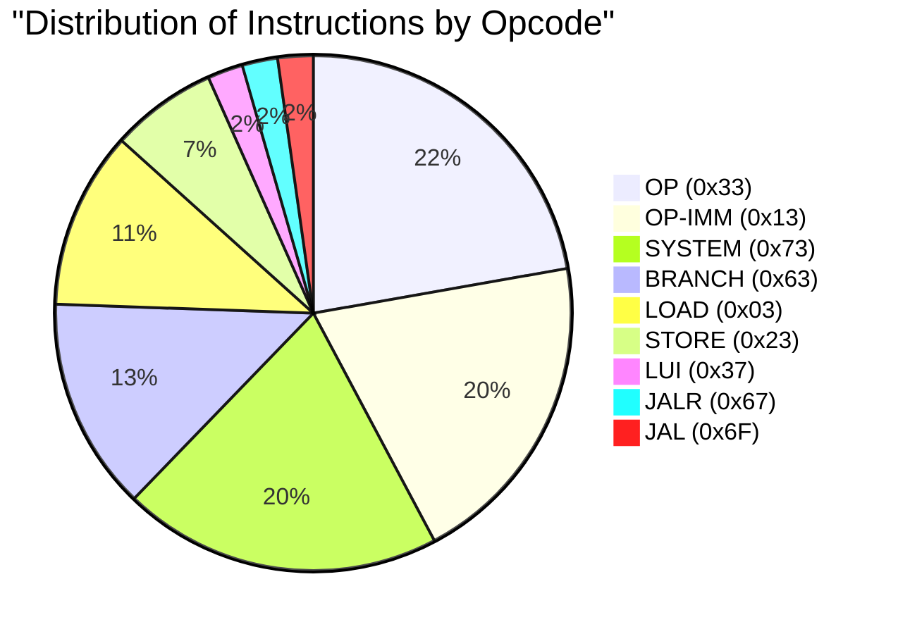
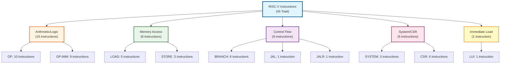

# Bảng Liệt Kê Opcode và Chức Năng RISC-V Core

> **Hướng dẫn export sang JPG:**
> 1. Sử dụng Mermaid Live Editor: https://mermaid.live/
> 2. Copy diagram vào editor
> 3. Click "Actions" -> "Download PNG"
> 4. Convert PNG sang JPG nếu cần
> 
> Hoặc sử dụng công cụ online để convert Markdown table sang image

---

## Bảng Tổng Quan Opcode

| Opcode (Hex) | Opcode (Binary) | Tên Nhóm | Số Instructions | Mô Tả |
|--------------|-----------------|----------|------------------|-------|
| **0x03** | 0000011 | LOAD | 5 | Load từ memory vào register |
| **0x13** | 0010011 | OP-IMM | 9 | Operations với immediate |
| **0x23** | 0100011 | STORE | 3 | Store từ register vào memory |
| **0x33** | 0110011 | OP | 10 | Register-to-register operations |
| **0x37** | 0110111 | LUI | 1 | Load Upper Immediate |
| **0x63** | 1100011 | BRANCH | 6 | Conditional branches |
| **0x67** | 1100111 | JALR | 1 | Jump and Link Register |
| **0x6F** | 1101111 | JAL | 1 | Jump and Link |
| **0x73** | 1110011 | SYSTEM | 9 | System calls và CSR operations |

**TỔNG CỘNG: 9 Opcode chính → 45 Instructions (Base RV32I)**

---

## Chi Tiết Theo Opcode

### 1. Opcode 0x03 - LOAD Instructions

| Instruction | funct3 | Mô Tả | Format |
|-------------|--------|-------|--------|
| **lb** | 000 | Load byte (signed) | `lb rd, offset(rs1)` |
| **lh** | 001 | Load halfword (signed) | `lh rd, offset(rs1)` |
| **lw** | 010 | Load word | `lw rd, offset(rs1)` |
| **lbu** | 100 | Load byte (unsigned) | `lbu rd, offset(rs1)` |
| **lhu** | 101 | Load halfword (unsigned) | `lhu rd, offset(rs1)` |

**Tổng: 5 instructions**

---

### 2. Opcode 0x13 - OP-IMM (Immediate Operations)

| Instruction | funct3 | Mô Tả | Format |
|-------------|--------|-------|--------|
| **addi** | 000 | Add immediate | `addi rd, rs1, imm` |
| **slti** | 010 | Set if less than (signed) | `slti rd, rs1, imm` |
| **sltiu** | 011 | Set if less than (unsigned) | `sltiu rd, rs1, imm` |
| **xori** | 100 | XOR immediate | `xori rd, rs1, imm` |
| **ori** | 110 | OR immediate | `ori rd, rs1, imm` |
| **andi** | 111 | AND immediate | `andi rd, rs1, imm` |
| **slli** | 001 | Shift left logical immediate | `slli rd, rs1, shamt` |
| **srli** | 101 | Shift right logical immediate | `srli rd, rs1, shamt` |
| **srai** | 101 | Shift right arithmetic immediate | `srai rd, rs1, shamt` |

**Tổng: 9 instructions**

---

### 3. Opcode 0x23 - STORE Instructions

| Instruction | funct3 | Mô Tả | Format |
|-------------|--------|-------|--------|
| **sb** | 000 | Store byte | `sb rs2, offset(rs1)` |
| **sh** | 001 | Store halfword | `sh rs2, offset(rs1)` |
| **sw** | 010 | Store word | `sw rs2, offset(rs1)` |

**Tổng: 3 instructions**

---

### 4. Opcode 0x33 - OP (Register Operations)

| Instruction | funct3 | funct7 | Mô Tả | Format |
|-------------|--------|--------|-------|--------|
| **add** | 000 | 0000000 | Add | `add rd, rs1, rs2` |
| **sub** | 000 | 0100000 | Subtract | `sub rd, rs1, rs2` |
| **sll** | 001 | 0000000 | Shift left logical | `sll rd, rs1, rs2` |
| **slt** | 010 | 0000000 | Set if less than (signed) | `slt rd, rs1, rs2` |
| **sltu** | 011 | 0000000 | Set if less than (unsigned) | `sltu rd, rs1, rs2` |
| **xor** | 100 | 0000000 | XOR | `xor rd, rs1, rs2` |
| **srl** | 101 | 0000000 | Shift right logical | `srl rd, rs1, rs2` |
| **sra** | 101 | 0100000 | Shift right arithmetic | `sra rd, rs1, rs2` |
| **or** | 110 | 0000000 | OR | `or rd, rs1, rs2` |
| **and** | 111 | 0000000 | AND | `and rd, rs1, rs2` |

**Tổng: 10 instructions**

---

### 5. Opcode 0x37 - LUI

| Instruction | Mô Tả | Format |
|-------------|-------|--------|
| **lui** | Load Upper Immediate | `lui rd, imm` |

**Tổng: 1 instruction**

---

### 6. Opcode 0x63 - BRANCH Instructions

| Instruction | funct3 | Mô Tả | Format |
|-------------|--------|-------|--------|
| **beq** | 000 | Branch if equal | `beq rs1, rs2, offset` |
| **bne** | 001 | Branch if not equal | `bne rs1, rs2, offset` |
| **blt** | 100 | Branch if less than (signed) | `blt rs1, rs2, offset` |
| **bge** | 101 | Branch if greater or equal (signed) | `bge rs1, rs2, offset` |
| **bltu** | 110 | Branch if less than (unsigned) | `bltu rs1, rs2, offset` |
| **bgeu** | 111 | Branch if greater or equal (unsigned) | `bgeu rs1, rs2, offset` |

**Tổng: 6 instructions**

---

### 7. Opcode 0x67 - JALR

| Instruction | funct3 | Mô Tả | Format |
|-------------|--------|-------|--------|
| **jalr** | 000 | Jump and Link Register | `jalr rd, offset(rs1)` |

**Tổng: 1 instruction**

---

### 8. Opcode 0x6F - JAL

| Instruction | Mô Tả | Format |
|-------------|-------|--------|
| **jal** | Jump and Link | `jal rd, offset` |

**Tổng: 1 instruction**

---

### 9. Opcode 0x73 - SYSTEM Instructions

#### System Calls

| Instruction | funct3 | Mô Tả | Format |
|-------------|--------|-------|--------|
| **ecall** | 000 | Environment call | `ecall` |
| **ebreak** | 000 | Environment break | `ebreak` |
| **mret** | 000 | Machine return | `mret` |

#### CSR Operations (Zicsr Extension)

| Instruction | funct3 | Mô Tả | Format |
|-------------|--------|-------|--------|
| **csrrw** | 001 | CSR read/write | `csrrw rd, csr, rs1` |
| **csrrs** | 010 | CSR read/set | `csrrs rd, csr, rs1` |
| **csrrc** | 011 | CSR read/clear | `csrrc rd, csr, rs1` |
| **csrrwi** | 101 | CSR read/write immediate | `csrrwi rd, csr, imm` |
| **csrrsi** | 110 | CSR read/set immediate | `csrrsi rd, csr, imm` |
| **csrrci** | 111 | CSR read/clear immediate | `csrrci rd, csr, imm` |

**Tổng: 9 instructions (3 system + 6 CSR)**

---

## Tổng Kết

### Base RV32I Instructions
- **Tổng số opcode**: 9
- **Tổng số instructions**: 45
  - LOAD: 5
  - OP-IMM: 9
  - STORE: 3
  - OP: 10
  - LUI: 1
  - BRANCH: 6
  - JALR: 1
  - JAL: 1
  - SYSTEM: 9

### Với Extensions

| Extension | Thêm Instructions | Tổng |
|-----------|-------------------|------|
| **Base (RV32I)** | 45 | 45 |
| **+ Zicsr** | 6 (CSR) | 51 |
| **+ C (Compressed)** | ~16 | ~67 |
| **+ M (Multiply/Divide)** | 8 | ~75 |

---

## Diagram Opcode Distribution



---

## Diagram Instruction Categories



---

## Bảng Opcode Mapping

```mermaid
graph LR
    subgraph "Opcode 0x03 - LOAD"
        L1[lb] --> L2[lh] --> L3[lw] --> L4[lbu] --> L5[lhu]
    end
    
    subgraph "Opcode 0x13 - OP-IMM"
        O1[addi] --> O2[slti] --> O3[sltiu] --> O4[xori] --> O5[ori] --> O6[andi] --> O7[slli] --> O8[srli] --> O9[srai]
    end
    
    subgraph "Opcode 0x23 - STORE"
        S1[sb] --> S2[sh] --> S3[sw]
    end
    
    subgraph "Opcode 0x33 - OP"
        P1[add] --> P2[sub] --> P3[sll] --> P4[slt] --> P5[sltu] --> P6[xor] --> P7[srl] --> P8[sra] --> P9[or] --> P10[and]
    end
    
    subgraph "Opcode 0x63 - BRANCH"
        B1[beq] --> B2[bne] --> B3[blt] --> B4[bge] --> B5[bltu] --> B6[bgeu]
    end
    
    subgraph "Opcode 0x73 - SYSTEM"
        SY1[ecall] --> SY2[ebreak] --> SY3[mret] --> SY4[csrrw] --> SY5[csrrs] --> SY6[csrrc] --> SY7[csrrwi] --> SY8[csrrsi] --> SY9[csrrci]
    end
    
    style L1 fill:#e8f5e9
    style O1 fill:#fff4e1
    style S1 fill:#e8f5e9
    style P1 fill:#fff4e1
    style B1 fill:#f3e5f5
    style SY1 fill:#fce4ec
```



---

## Cách Export Bảng Sang JPG

### Phương pháp 1: Sử dụng Mermaid Live Editor (Khuyến nghị)

1. Truy cập: https://mermaid.live/
2. Copy các diagram (pie chart, graph) vào editor
3. Click "Actions" -> "Download PNG"
4. Convert PNG sang JPG nếu cần

### Phương pháp 2: Sử dụng Markdown Table to Image Converter

1. Truy cập: https://www.tablesgenerator.com/markdown_tables
2. Paste markdown table
3. Export sang PNG/JPG

### Phương pháp 3: Sử dụng Screenshot Tool

1. Mở file .md trong VS Code với Markdown Preview
2. Chụp màn hình bảng
3. Lưu dưới dạng JPG

### Phương pháp 4: Sử dụng Pandoc + ImageMagick

```bash
# Convert markdown to HTML
pandoc RISC_V_OPCODE_TABLE.md -o output.html

# Convert HTML to image (cần wkhtmltopdf hoặc headless browser)
# Sau đó convert sang JPG
```

---

## Thông Tin Bổ Sung

### SERV RISC-V Core Specifications

- **ISA Base**: RV32IZifencei
- **Architecture**: Bit-serial (1 bit/cycle)
- **Register File**: 32 registers (x0-x31)
- **PC Width**: 32 bits
- **Reset PC**: 0x00000000 (default)

### Opcode Encoding

- **Opcode bits**: [6:2] (5 bits)
- **funct3 bits**: [14:12] (3 bits)
- **funct7 bits**: [31:25] (7 bits)

### Instruction Formats

| Format | Fields | Mô Tả |
|--------|--------|-------|
| **R-type** | funct7, rs2, rs1, funct3, rd, opcode | Register operations |
| **I-type** | imm[11:0], rs1, funct3, rd, opcode | Immediate operations, Loads, JALR |
| **S-type** | imm[11:5], rs2, rs1, funct3, imm[4:0], opcode | Stores |
| **B-type** | imm[12\|10:5], rs2, rs1, funct3, imm[4:1\|11], opcode | Branches |
| **U-type** | imm[31:12], rd, opcode | LUI, AUIPC |
| **J-type** | imm[20\|10:1\|11\|19:12], rd, opcode | JAL |

---

## Kết Luận

Khối RISC-V core của bạn hỗ trợ:
- **9 opcode chính**
- **45 instructions** (Base RV32I)
- **51 instructions** (với Zicsr extension)
- **~67 instructions** (với C extension)
- **~75 instructions** (với C + M extensions)

Tất cả các instructions được decode dựa trên opcode [6:2] và các control bits (funct3, funct7) để xác định chức năng cụ thể.


