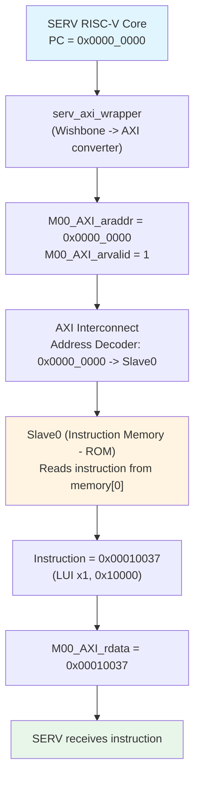
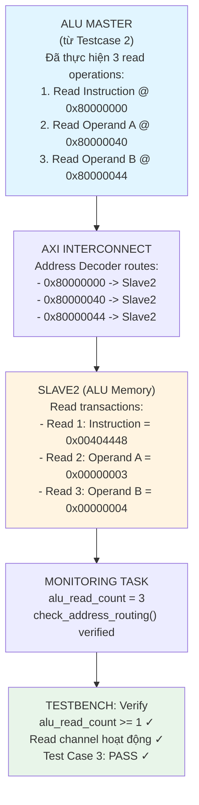
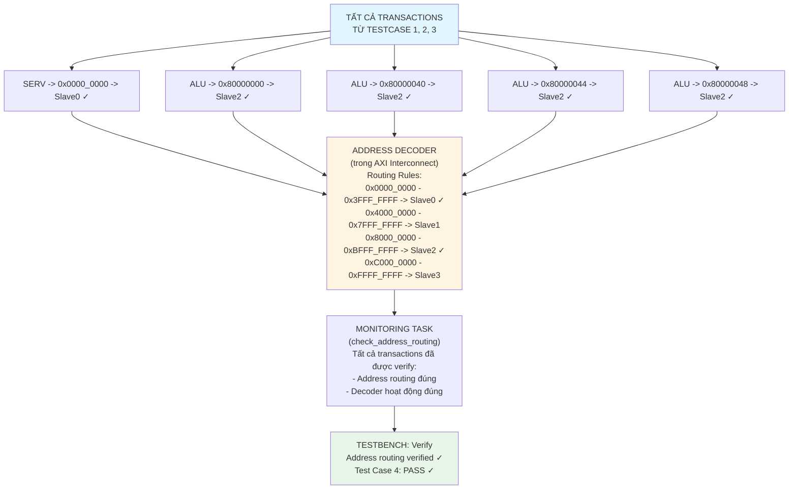
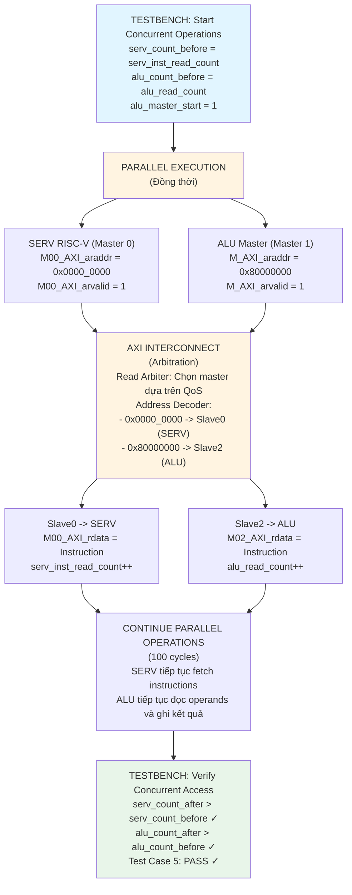
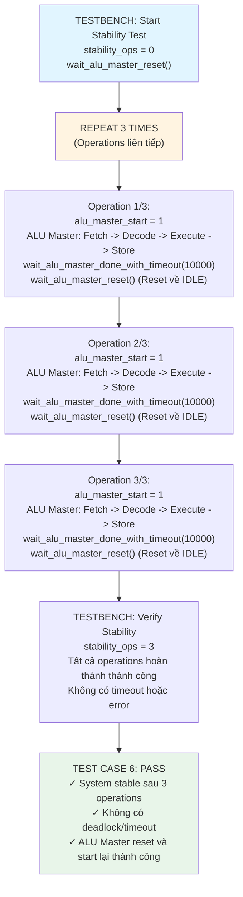
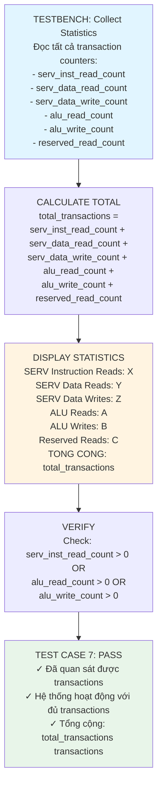

# Luồng Dữ Liệu - 7 Test Cases

> **Hướng dẫn export sang JPG:**
> 1. Sử dụng Mermaid Live Editor: https://mermaid.live/
> 2. Copy từng diagram vào editor
> 3. Click "Actions" -> "Download PNG" hoặc "Download SVG"
> 4. Hoặc sử dụng Mermaid CLI: `mmdc -i diagram.mmd -o diagram.jpg`

---

## TEST CASE 1: SERV Master -> Instruction Memory (Read at Reset PC)



---

## TEST CASE 2: ALU Master -> ALU Memory (Write Operation)

```mermaid
flowchart TD
    A["ALU MASTER<br/>PC = 0x0000_0000<br/>Start execution"] --> B["CPU_ALU_MASTER (AXI Master)<br/>M_AXI_araddr = 0x80000000<br/>M_AXI_arvalid = 1"]
    B --> C["AXI INTERCONNECT<br/>Address Decoder: 0x80000000 -> Slave2"]
    C --> D["SLAVE2 (ALU Memory - RAM)<br/>Reads instruction from memory[0]<br/>Instruction = 0x00404448<br/>(ADD, src1=0x40, src2=0x44, dst=0x48)"]
    D --> E["CPU_CONTROLLER: DECODE<br/>Opcode = 0x0 (ADD)<br/>src_addr1 = 0x40, src_addr2 = 0x44, dst_addr = 0x48"]
    E --> F["CPU_ALU_MASTER: Read Operand A<br/>M_AXI_araddr = 0x80000040"]
    F --> G["SLAVE2 -> M02_AXI_rdata = 0x00000003<br/>(a = 3)"]
    G --> H["CPU_ALU_MASTER: Read Operand B<br/>M_AXI_araddr = 0x80000044"]
    H --> I["SLAVE2 -> M02_AXI_rdata = 0x00000004<br/>(b = 4)"]
    I --> J["ALU_CORE: EXECUTE<br/>Input: a=3, b=4, opcode=ADD<br/>Result: 3 + 4 = 7<br/>alu_result = 0x00000007"]
    J --> K["CPU_ALU_MASTER: Write Result<br/>M_AXI_awaddr = 0x80000048<br/>M_AXI_wdata = 0x00000007"]
    K --> L["AXI INTERCONNECT<br/>Address Decoder: 0x80000048 -> Slave2"]
    L --> M["SLAVE2 (ALU Memory)<br/>Writes result to memory[18]<br/>Memory[0x80000048] = 0x00000007"]
    M --> N["TESTBENCH: Verify<br/>Memory[0x80000048] = 0x00000007 ✓<br/>alu_write_count = 1 ✓<br/>Test Case 2: PASS ✓"]
    
    style A fill:#e1f5ff
    style J fill:#fff4e1
    style M fill:#fff4e1
    style N fill:#e8f5e9
```



---

## TEST CASE 3: ALU Master -> ALU Memory (Read Operation)



---

## TEST CASE 4: Address Routing Verification



---

## TEST CASE 5: Concurrent Access - SERV(Inst) + ALU(ALU Mem)



---

## TEST CASE 6: System Stability Under Continuous Operation



---

## TEST CASE 7: Transaction Statistics



---

## Cách Export Sang JPG

### Phương pháp 1: Sử dụng Mermaid Live Editor (Khuyến nghị)

1. Truy cập: https://mermaid.live/
2. Copy từng diagram (từ ````mermaid` đến ````) vào editor
3. Click "Actions" -> "Download PNG" hoặc "Download SVG"
4. Convert PNG sang JPG nếu cần (có thể dùng online converter)

### Phương pháp 2: Sử dụng Mermaid CLI

```bash
# Cài đặt Mermaid CLI
npm install -g @mermaid-js/mermaid-cli

# Export từng diagram
mmdc -i testcase1.mmd -o testcase1.jpg -b white
mmdc -i testcase2.mmd -o testcase2.jpg -b white
# ... và tiếp tục cho các testcase khác
```

### Phương pháp 3: Sử dụng VS Code Extension

1. Cài đặt extension "Markdown Preview Mermaid Support"
2. Mở file .md trong VS Code
3. Preview diagram
4. Right-click -> "Save Image As..." -> chọn JPG

### Phương pháp 4: Sử dụng GitHub/GitLab

1. Push file .md lên GitHub/GitLab
2. GitHub/GitLab tự động render Mermaid diagrams
3. Right-click trên diagram -> "Save image as..." -> JPG
