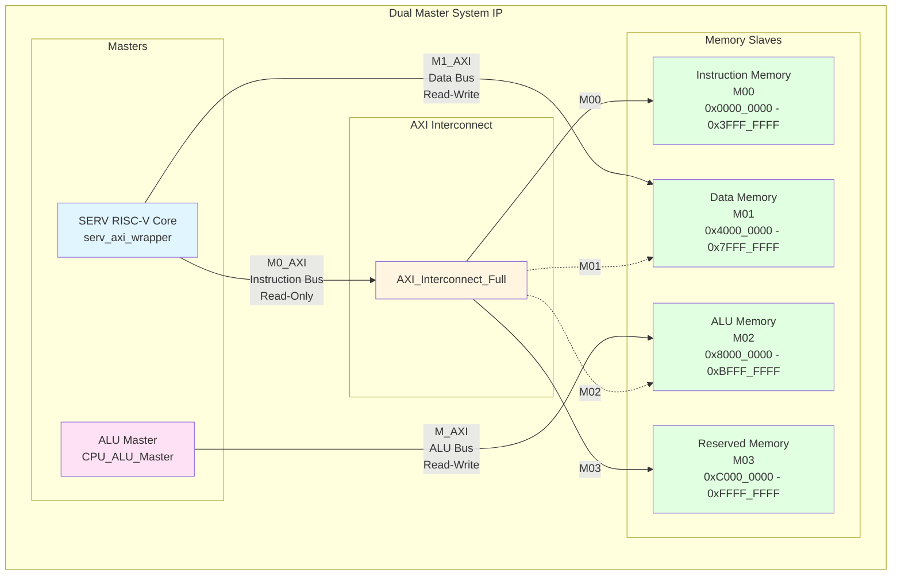
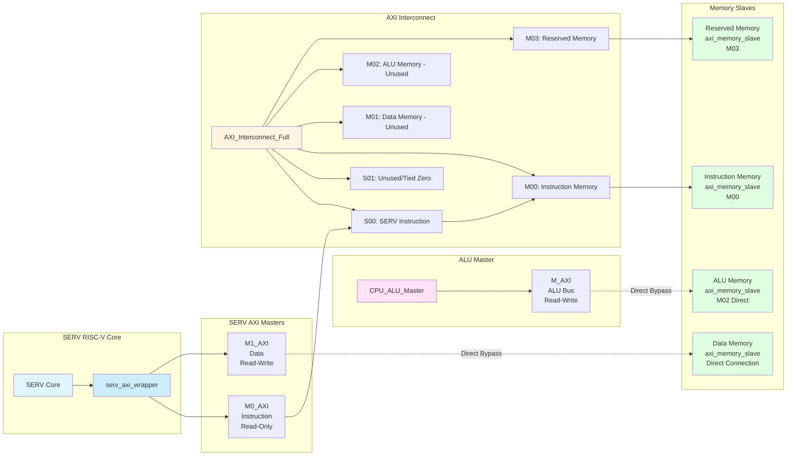

# Dual Master System IP - Block Diagram

## Overview

This document describes the block diagram and architecture of the `dual_master_system_ip` module, which integrates a SERV RISC-V core, an ALU Master, AXI Interconnect, and multiple memory slaves.

## System Architecture

### High-Level Block Diagram



## Detailed Connection Diagram

### AXI Bus Connections



## Address Space Mapping

| Memory Slave | Address Range | Size | Access Type | Connected To |
|-------------|---------------|------|-------------|--------------|
| Instruction Memory (M00) | 0x0000_0000 - 0x3FFF_FFFF | 1 GB | Read-Only | SERV Instruction Bus (via Interconnect) |
| Data Memory (M01) | 0x4000_0000 - 0x7FFF_FFFF | 1 GB | Read-Write | SERV Data Bus (Direct, bypasses Interconnect) |
| ALU Memory (M02) | 0x8000_0000 - 0xBFFF_FFFF | 1 GB | Read-Write | ALU Master (Direct, bypasses Interconnect) |
| Reserved Memory (M03) | 0xC000_0000 - 0xFFFF_FFFF | 1 GB | Read-Only | SERV Instruction Bus (via Interconnect) |

## Signal Flow

### Instruction Fetch Path (SERV)
```
SERV Core → serv_axi_wrapper → M0_AXI → S00 (Interconnect) → M00 → Instruction Memory
```

### Data Access Path (SERV)
```
SERV Core → serv_axi_wrapper → M1_AXI → Data Memory (Direct Connection, bypasses Interconnect)
```

### ALU Master Path
```
ALU Master → M_AXI → ALU Memory (Direct Connection, bypasses Interconnect)
```

### Reserved Memory Access Path (SERV)
```
SERV Core → serv_axi_wrapper → M0_AXI → S00 (Interconnect) → M03 → Reserved Memory
```

## Key Design Notes

1. **Direct Connections**: 
   - SERV Data Bus (M1_AXI) connects directly to Data Memory, bypassing the interconnect for better performance
   - ALU Master connects directly to ALU Memory, bypassing the interconnect (as interconnect only supports 2 masters)

2. **Interconnect Usage**:
   - Only SERV Instruction Bus (S00) actively uses the interconnect
   - S01 port is tied to zero (unused)
   - M01 and M02 ports of interconnect are unused due to direct connections

3. **Memory Configuration**:
   - Default memory size: 256 words per memory (configurable via parameters)
   - All memories support initialization from hex files
   - Instruction and Reserved memories are read-only
   - Data and ALU memories support read-write operations

4. **AXI Protocol**:
   - All buses use AXI4 protocol
   - ID_WIDTH = 4 bits
   - ADDR_WIDTH = 32 bits
   - DATA_WIDTH = 32 bits

## Module Hierarchy

```
dual_master_system_ip
├── serv_axi_wrapper
│   └── SERV RISC-V Core
├── CPU_ALU_Master
├── AXI_Interconnect_Full
│   ├── S00: SERV Instruction Bus
│   ├── S01: Unused (tied zero)
│   ├── M00: Instruction Memory
│   ├── M01: Data Memory (unused)
│   ├── M02: ALU Memory (unused)
│   └── M03: Reserved Memory
├── axi_memory_slave (Instruction Memory - M00)
├── axi_memory_slave (Data Memory - Direct)
├── axi_memory_slave (ALU Memory - M02 Direct)
└── axi_memory_slave (Reserved Memory - M03)
```

## Control Signals

### Inputs
- `ACLK`: System clock
- `ARESETN`: Active-low reset
- `i_timer_irq`: Timer interrupt (optional)
- `alu_master_start`: Start signal for ALU Master

### Outputs
- `alu_master_busy`: ALU Master busy status
- `alu_master_done`: ALU Master completion status
- `inst_mem_ready`: Instruction memory ready status
- `data_mem_ready`: Data memory ready status
- `alu_mem_ready`: ALU memory ready status
- `reserved_mem_ready`: Reserved memory ready status

## Notes

- The interconnect's M01 and M02 ports are intentionally unused because:
  - SERV Data Bus bypasses interconnect for direct connection to Data Memory
  - ALU Master bypasses interconnect for direct connection to ALU Memory
- This design optimizes for performance by reducing latency through direct connections where possible.

