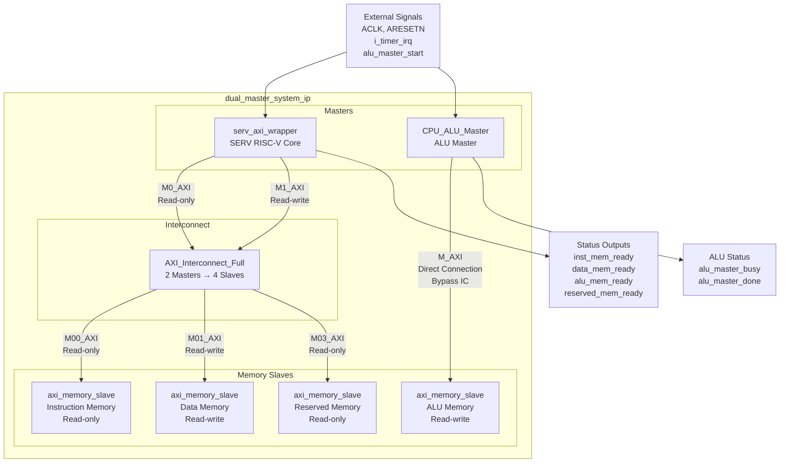
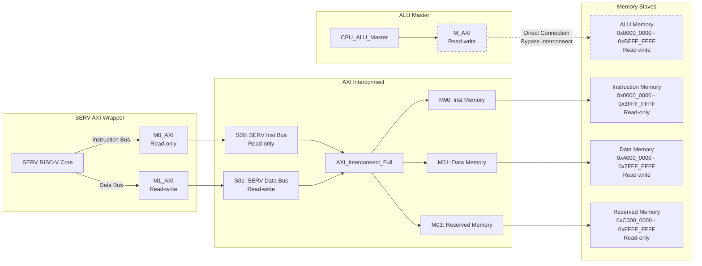
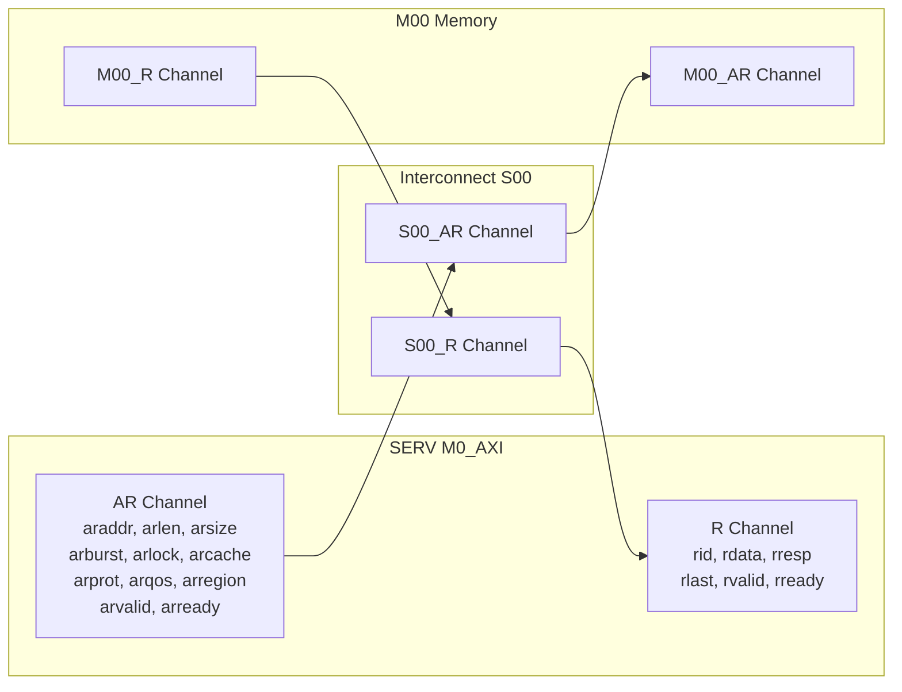
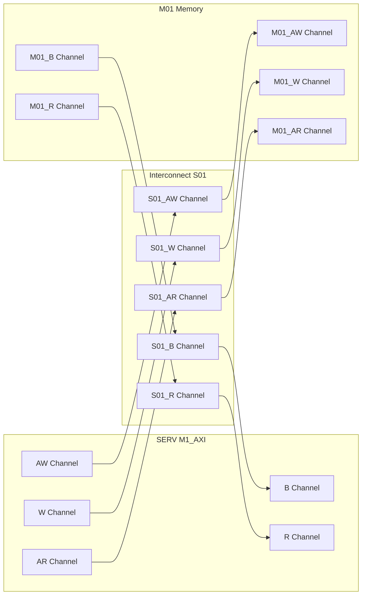
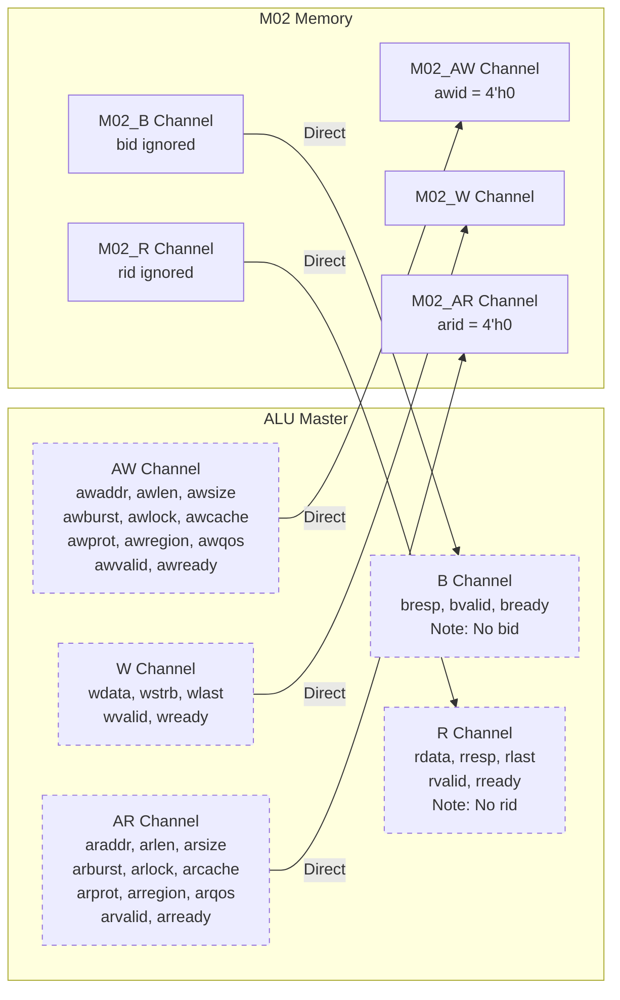
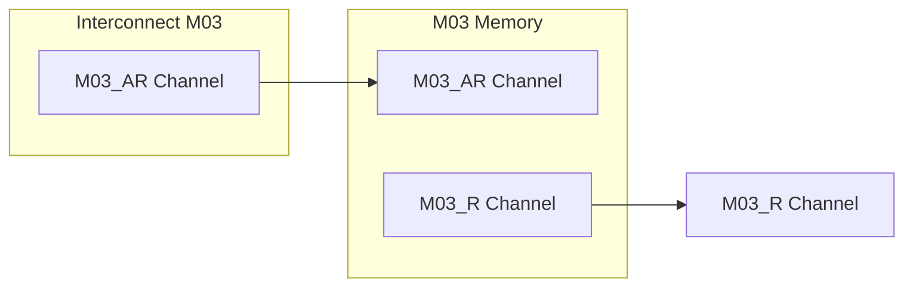
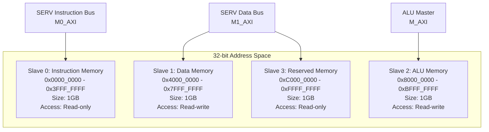
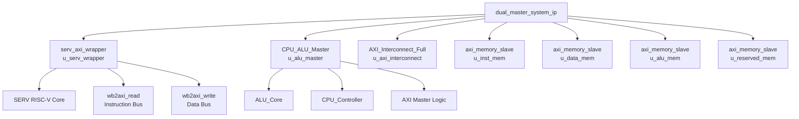
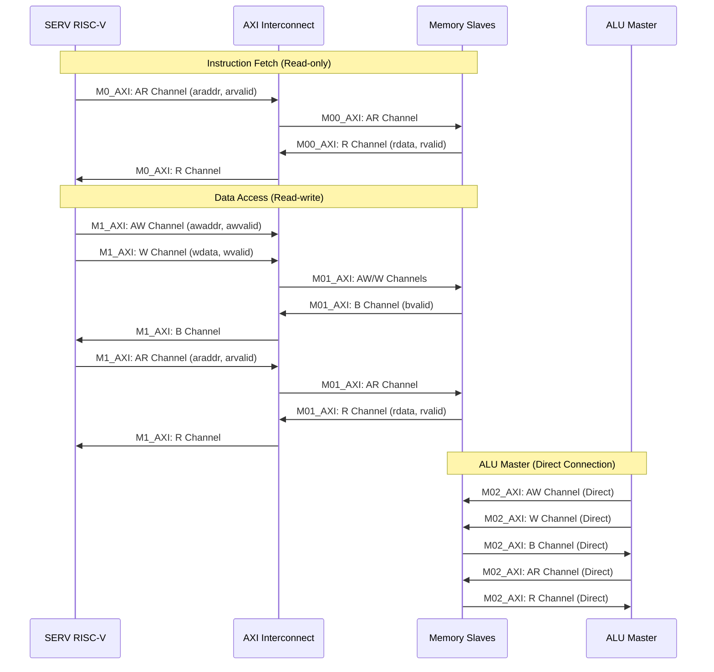

# Dual Master System IP - Detailed Architecture Diagram

## Module: `dual_master_system_ip`

Complete IP module integrating SERV RISC-V Core, ALU Master, AXI Interconnect, and 4 Memory Slaves.

---

## 1. System Architecture Overview

---

## 2. Detailed AXI Connection Diagram

---

## 3. AXI Channel Details

### 3.1 SERV Instruction Bus (M0_AXI / S00_AXI) - Read-only

**Channels:**
- ✅ **Read Address (AR)**: Full channel
- ✅ **Read Data (R)**: Full channel
- ❌ **Write Address (AW)**: Not used (tied to 0)
- ❌ **Write Data (W)**: Not used (tied to 0)
- ❌ **Write Response (B)**: Not used (tied to 0)

### 3.2 SERV Data Bus (M1_AXI / S01_AXI) - Read-write

**Channels:**
- ✅ **Write Address (AW)**: Full channel
- ✅ **Write Data (W)**: Full channel
- ✅ **Write Response (B)**: Full channel
- ✅ **Read Address (AR)**: Full channel
- ✅ **Read Data (R)**: Full channel

### 3.3 ALU Master (S02_AXI / M02_AXI) - Direct Connection

**Channels:**
- ✅ **Write Address (AW)**: Direct connection (bypass interconnect)
- ✅ **Write Data (W)**: Direct connection
- ✅ **Write Response (B)**: Direct connection (bid ignored)
- ✅ **Read Address (AR)**: Direct connection
- ✅ **Read Data (R)**: Direct connection (rid ignored)

**Note:** ALU Master bypasses interconnect because `AXI_Interconnect_Full` only supports 2 masters (S00, S01).

### 3.4 Reserved Memory (M03_AXI) - Read-only

**Channels:**
- ✅ **Read Address (AR)**: Full channel
- ✅ **Read Data (R)**: Full channel
- ❌ **Write Address (AW)**: Dummy wires (tied to 0)
- ❌ **Write Data (W)**: Dummy wires (tied to 0)
- ❌ **Write Response (B)**: Dummy wires (tied to 0)

---

## 4. Address Mapping

**Address Ranges:**
- **Slave 0 (M00)**: `0x0000_0000` - `0x3FFF_FFFF` (Instruction Memory, Read-only)
- **Slave 1 (M01)**: `0x4000_0000` - `0x7FFF_FFFF` (Data Memory, Read-write)
- **Slave 2 (M02)**: `0x8000_0000` - `0xBFFF_FFFF` (ALU Memory, Read-write)
- **Slave 3 (M03)**: `0xC000_0000` - `0xFFFF_FFFF` (Reserved Memory, Read-only)

---

## 5. Module Instantiation Hierarchy

---

## 6. Signal Flow Diagram

---

## 7. Port Interface Summary

### 7.1 Input Ports

| Port Name | Width | Description |
|-----------|-------|-------------|
| `ACLK` | 1 | Global clock signal |
| `ARESETN` | 1 | Active-low reset signal |
| `i_timer_irq` | 1 | Timer interrupt (optional) |
| `alu_master_start` | 1 | ALU Master start control signal |

### 7.2 Output Ports

| Port Name | Width | Description |
|-----------|-------|-------------|
| `alu_master_busy` | 1 | ALU Master busy status |
| `alu_master_done` | 1 | ALU Master done status |
| `inst_mem_ready` | 1 | Instruction memory ready status |
| `data_mem_ready` | 1 | Data memory ready status |
| `alu_mem_ready` | 1 | ALU memory ready status |
| `reserved_mem_ready` | 1 | Reserved memory ready status |

---

## 8. Key Design Notes

### 8.1 ALU Master Direct Connection

- **Reason**: `AXI_Interconnect_Full` only supports 2 masters (S00, S01)
- **Solution**: ALU Master (S02) connects directly to M02 memory slave
- **Implementation**: Direct `assign` statements (lines 560-607)
- **Limitation**: ALU Master cannot access other memory slaves through interconnect

### 8.2 Read-only Memory Slaves

- **M00 (Instruction Memory)**: Write channels tied to dummy wires
- **M03 (Reserved Memory)**: Write channels tied to dummy wires
- **Note**: Memory modules still instantiated with full AXI interface, but write channels are unused

### 8.3 ID Signal Handling

- **M00**: `arid` tied to `4'h0` (read-only, no ID needed)
- **M02**: `awid` and `arid` tied to `4'h0` (ALU Master doesn't use ID)
- **M02**: `bid` and `rid` from memory are connected but ignored by ALU Master

### 8.4 Status Outputs

- `inst_mem_ready`: Based on `M00_AXI_arready`
- `data_mem_ready`: Based on `M01_AXI_awready | M01_AXI_arready`
- `alu_mem_ready`: Based on `M02_AXI_awready | M02_AXI_arready`
- `reserved_mem_ready`: Based on `M03_AXI_arready`

---

## 9. Memory Configuration

| Memory | Size (words) | Init File | Address Range | Access Type |
|--------|--------------|-----------|---------------|-------------|
| Instruction | 256 (default) | `INST_MEM_INIT_FILE` | 0x0000_0000 - 0x3FFF_FFFF | Read-only |
| Data | 256 (default) | `DATA_MEM_INIT_FILE` | 0x4000_0000 - 0x7FFF_FFFF | Read-write |
| ALU | 256 (default) | `ALU_MEM_INIT_FILE` | 0x8000_0000 - 0xBFFF_FFFF | Read-write |
| Reserved | 256 (default) | `RESERVED_MEM_INIT_FILE` | 0xC000_0000 - 0xFFFF_FFFF | Read-only |

**Note**: Memory sizes are parameterized and can be increased if device has more resources.

---

## 10. Timing and Clock Domains

- **All modules**: Synchronous to `ACLK`
- **Reset**: Active-low (`ARESETN`)
- **Clock domain**: Single clock domain (all modules share `ACLK`)
- **No clock domain crossing**: All AXI signals are synchronous

---

## References

- Module file: `src/wrapper/ip/dual_master_system_ip.v`
- SERV Wrapper: `src/wrapper/converters/serv_axi_wrapper.v`
- ALU Master: `src/cores/alu/CPU_ALU_Master.v`
- AXI Interconnect: `src/axi_interconnect/rtl/core/AXI_Interconnect_Full.v`
- Memory Slave: `src/wrapper/memory/axi_memory_slave.v` (assumed)

