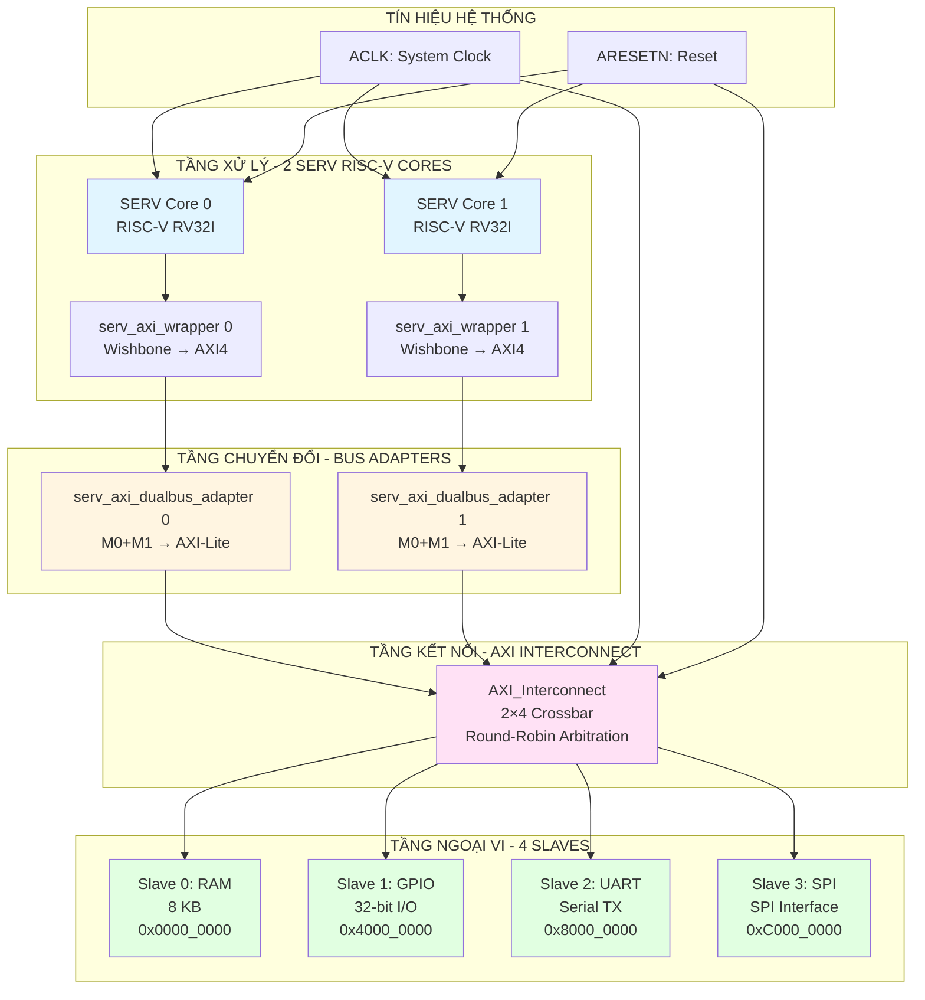
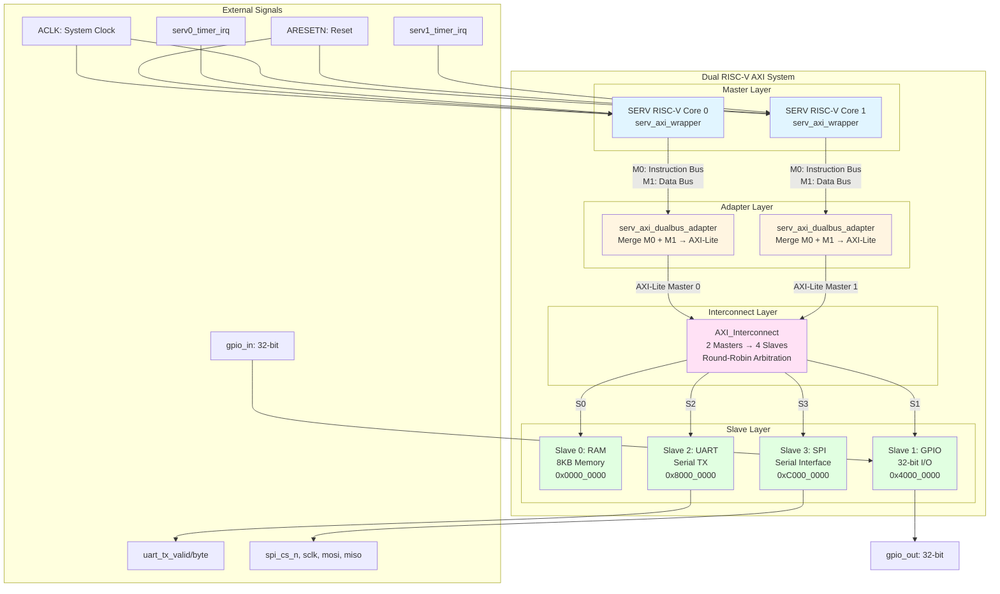
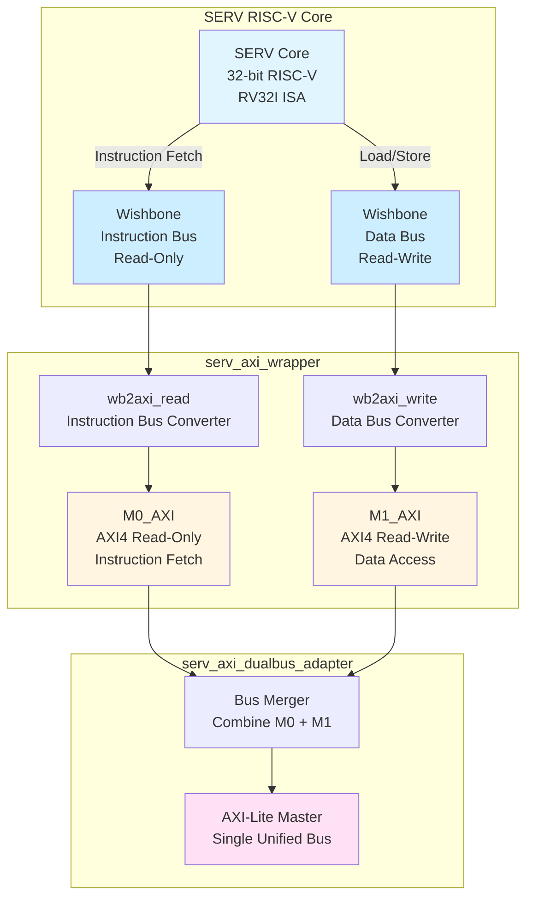
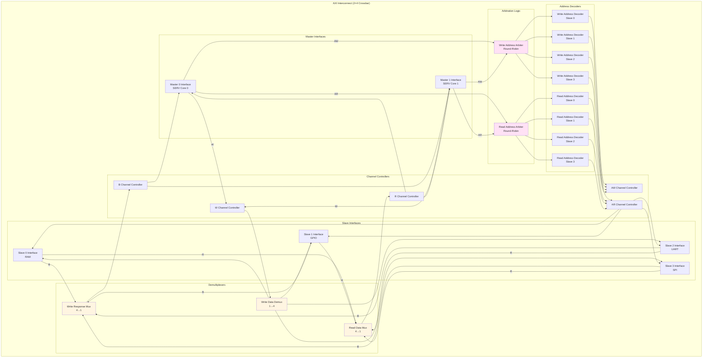
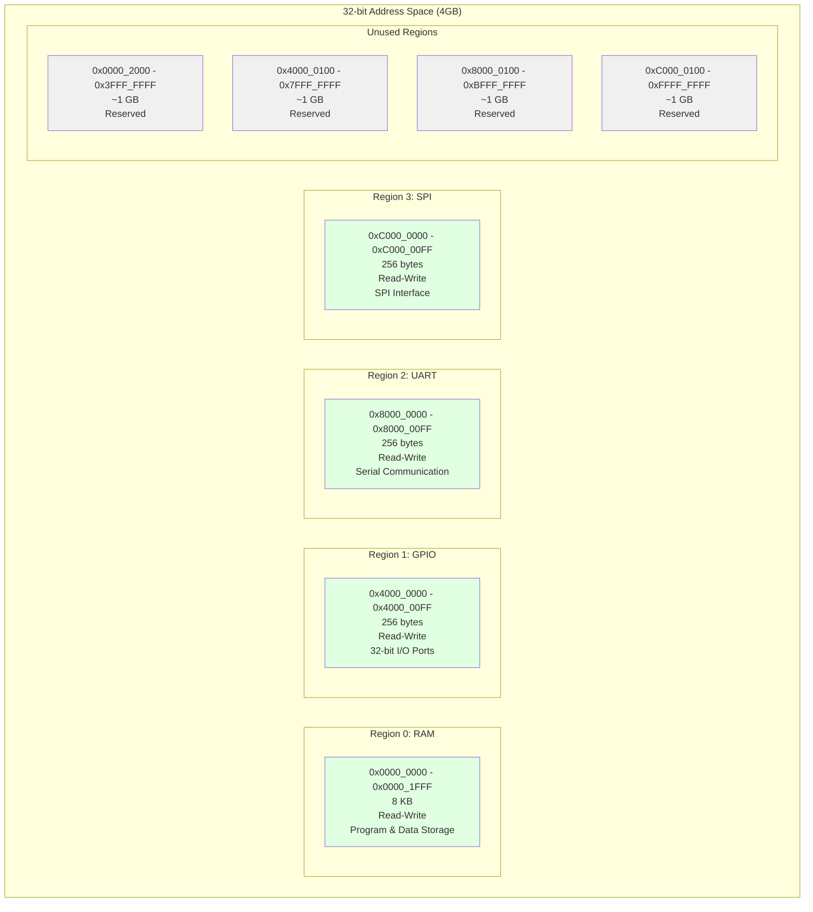
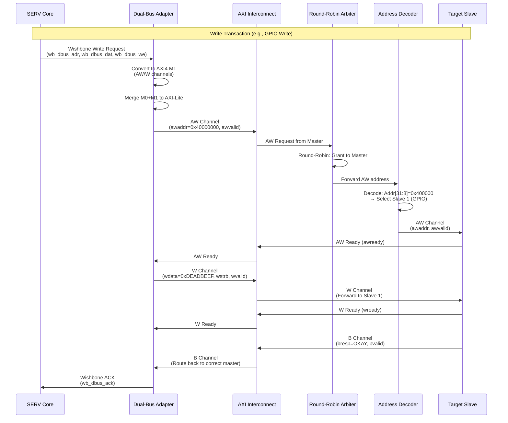
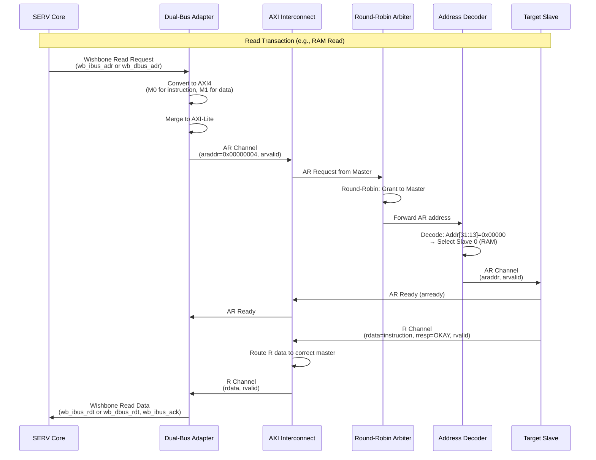

# Kiến Trúc Phần Cứng: Hệ Thống 2 Master RISC-V - 4 Slave

## Tổng Quan

Hệ thống **Dual RISC-V AXI System** là một SoC (System-on-Chip) tích hợp 2 bộ xử lý RISC-V (SERV cores) kết nối với 4 thiết bị ngoại vi (Slaves) thông qua một AXI Interconnect với thuật toán Round-Robin arbitration.

**Module chính:** `dual_riscv_axi_system.v`

---

## 0. Khối Tổng Thể (Overall Block Diagram)

### 0.1. Sơ Đồ Khối Tổng Thể Chi Tiết

#### Sơ Đồ Mermaid (Interactive)



#### Sơ Đồ ASCII Art (Text-based - Luôn hiển thị)

```
┌─────────────────────────────────────────────────────────────────────────────┐
│                    KHỐI TỔNG THỂ - DUAL RISC-V AXI SYSTEM                   │
└─────────────────────────────────────────────────────────────────────────────┘

┌─────────────────────────────────────────────────────────────────────────────┐
│  TẦNG XỬ LÝ (Processing Layer)                                             │
├─────────────────────────────────────────────────────────────────────────────┤
│                                                                             │
│  ┌──────────────────────┐          ┌──────────────────────┐               │
│  │  SERV RISC-V Core 0  │          │  SERV RISC-V Core 1  │               │
│  │  32-bit RV32I ISA    │          │  32-bit RV32I ISA    │               │
│  │  Bit-serial Arch     │          │  Bit-serial Arch     │               │
│  └──────────┬───────────┘          └──────────┬───────────┘               │
│             │                                  │                            │
│             │ Wishbone                        │ Wishbone                   │
│             │ IBUS + DBUS                     │ IBUS + DBUS                │
│             ▼                                  ▼                            │
│  ┌──────────────────────┐          ┌──────────────────────┐               │
│  │ serv_axi_wrapper 0   │          │ serv_axi_wrapper 1   │               │
│  │ Wishbone → AXI4      │          │ Wishbone → AXI4      │               │
│  │ M0: Instruction Bus  │          │ M0: Instruction Bus  │               │
│  │ M1: Data Bus         │          │ M1: Data Bus         │               │
│  └──────────┬───────────┘          └──────────┬───────────┘               │
│             │                                  │                            │
│             │ AXI4                            │ AXI4                       │
│             │ M0 + M1                         │ M0 + M1                    │
│             ▼                                  ▼                            │
└─────────────┼──────────────────────────────────┼────────────────────────────┘
              │                                  │
┌─────────────┼──────────────────────────────────┼────────────────────────────┐
│  TẦNG CHUYỂN ĐỔI (Adapter Layer)              │                            │
├─────────────┼──────────────────────────────────┼────────────────────────────┤
│             │                                  │                            │
│             ▼                                  ▼                            │
│  ┌──────────────────────┐          ┌──────────────────────┐               │
│  │ dualbus_adapter 0    │          │ dualbus_adapter 1    │               │
│  │ Merge M0 + M1        │          │ Merge M0 + M1        │               │
│  │ AXI4 → AXI-Lite      │          │ AXI4 → AXI-Lite      │               │
│  └──────────┬───────────┘          └──────────┬───────────┘               │
│             │                                  │                            │
│             │ AXI-Lite Master 0                │ AXI-Lite Master 1          │
│             │ Unified Bus                      │ Unified Bus                │
│             ▼                                  ▼                            │
└─────────────┼──────────────────────────────────┼────────────────────────────┘
              │                                  │
              └──────────────┬───────────────────┘
                             │
┌────────────────────────────┼────────────────────────────────────────────────┐
│  TẦNG KẾT NỐI (Interconnect Layer)          │                              │
├────────────────────────────┼────────────────────────────────────────────────┤
│                             │                                                │
│                             ▼                                                │
│              ┌──────────────────────────────────────┐                        │
│              │   AXI_Interconnect (2×4 Crossbar)    │                        │
│              │                                       │                        │
│              │  ┌────────────────────────────────┐  │                        │
│              │  │ Round-Robin Arbitration       │  │                        │
│              │  │ - Write Address Arbiter       │  │                        │
│              │  │ - Read Address Arbiter        │  │                        │
│              │  └────────────────────────────────┘  │                        │
│              │                                       │                        │
│              │  ┌────────────────────────────────┐  │                        │
│              │  │ Address Decoder                │  │                        │
│              │  │ - S0: 0x0000_0000 (RAM)       │  │                        │
│              │  │ - S1: 0x4000_0000 (GPIO)      │  │                        │
│              │  │ - S2: 0x8000_0000 (UART)      │  │                        │
│              │  │ - S3: 0xC000_0000 (SPI)       │  │                        │
│              │  └────────────────────────────────┘  │                        │
│              │                                       │                        │
│              │  ┌────────────────────────────────┐  │                        │
│              │  │ Channel Routing                │  │                        │
│              │  │ - Write Data Demux (1→4)      │  │                        │
│              │  │ - Response Mux (4→1)          │  │                        │
│              │  │ - Read Data Mux (4→1)         │  │                        │
│              │  └────────────────────────────────┘  │                        │
│              └───────────────┬───────────────────────┘                        │
│                              │                                                │
│                              │ AXI-Lite                                       │
│                              │ 4 Slaves                                       │
│                              ▼                                                │
└──────────────────────────────┼────────────────────────────────────────────────┘
                               │
              ┌────────────────┼────────────────┐
              │                │                │                │
              ▼                ▼                ▼                ▼
┌─────────────┼────────────────┼────────────────┼────────────────┼─────────────┐
│  TẦNG NGOẠI VI (Peripheral Layer)          │                              │
├─────────────┼────────────────┼────────────────┼────────────────┼─────────────┤
│             │                │                │                │             │
│             ▼                ▼                ▼                ▼             │
│  ┌──────────────┐  ┌──────────────┐  ┌──────────────┐  ┌──────────────┐   │
│  │ Slave 0: RAM │  │Slave 1: GPIO │  │Slave 2: UART │  │Slave 3: SPI  │   │
│  │              │  │              │  │              │  │              │   │
│  │ 8 KB Memory  │  │ 32-bit I/O   │  │ Serial TX    │  │ SPI Master   │   │
│  │ 2048 words   │  │ DATA/DIR/IN  │  │ TX_DATA      │  │ DATA/CTRL    │   │
│  │ Read-Write   │  │ Read-Write   │  │ STATUS       │  │ STATUS       │   │
│  │              │  │              │  │              │  │              │   │
│  │ 0x0000_0000  │  │ 0x4000_0000  │  │ 0x8000_0000  │  │ 0xC000_0000  │   │
│  └──────┬───────┘  └──────┬───────┘  └──────┬───────┘  └──────┬───────┘   │
│         │                 │                 │                 │             │
│         │ gpio_in[31:0]   │                 │                 │             │
│         │ gpio_out[31:0]  │                 │                 │             │
│         │                 │                 │                 │             │
│         │                 │ uart_tx_valid   │                 │             │
│         │                 │ uart_tx_byte[7:0]│                │             │
│         │                 │                 │                 │             │
│         │                 │                 │ spi_cs_n        │             │
│         │                 │                 │ spi_sclk        │             │
│         │                 │                 │ spi_mosi        │             │
│         │                 │                 │ spi_miso        │             │
└─────────┴─────────────────┴─────────────────┴─────────────────┴─────────────┘

┌─────────────────────────────────────────────────────────────────────────────┐
│  TÍN HIỆU HỆ THỐNG (System Signals)                                        │
├─────────────────────────────────────────────────────────────────────────────┤
│                                                                             │
│  ACLK (System Clock) ──────┐                                               │
│    └─→ All modules         │                                               │
│                            │                                               │
│  ARESETN (Reset) ──────────┼─→ All modules                                 │
│    └─→ Active-Low, Sync    │                                               │
│                            │                                               │
│  serv0_timer_irq ──────────┼─→ SERV Core 0                                 │
│  serv1_timer_irq ──────────┼─→ SERV Core 1                                 │
│                                                                             │
└─────────────────────────────────────────────────────────────────────────────┘
```

### 0.2. Mô Tả Các Khối Chức Năng

#### **TẦNG XỬ LÝ (Processing Layer)**

```
┌─────────────────────────────────────────────────────────────┐
│ SERV RISC-V Core (×2)                                       │
├─────────────────────────────────────────────────────────────┤
│                                                              │
│  Chức năng:                                                  │
│    - Thực thi lệnh RISC-V 32-bit                            │
│    - Bit-serial architecture (tiết kiệm tài nguyên)         │
│    - RV32I instruction set                                   │
│    - Separate instruction và data buses                      │
│                                                              │
│  Đặc điểm:                                                   │
│    - Core 0: Reset PC = 0x0000_0000 (default)               │
│    - Core 1: Reset PC = 0x0000_0000 (configurable)          │
│    - Timer interrupt support (optional)                      │
│    - Wishbone protocol interface                             │
│                                                              │
│  Bus Structure:                                              │
│    - M0: Instruction fetch bus (Read-only)                   │
│    - M1: Data access bus (Read-Write)                        │
│                                                              │
└─────────────────────────────────────────────────────────────┘
```

#### **TẦNG CHUYỂN ĐỔI (Adapter Layer)**

```
┌─────────────────────────────────────────────────────────────┐
│ serv_axi_dualbus_adapter (×2)                               │
├─────────────────────────────────────────────────────────────┤
│                                                              │
│  Chức năng:                                                  │
│    - Merge 2 AXI4 buses (M0 + M1) thành 1 AXI-Lite bus      │
│    - Protocol conversion: AXI4 → AXI-Lite                    │
│    - Address routing: Instruction vs Data                    │
│    - Transaction ordering preservation                       │
│                                                              │
│  Input:                                                      │
│    - M0_AXI: Instruction bus (AR/R channels only)            │
│    - M1_AXI: Data bus (AW/W/B/AR/R channels)                │
│                                                              │
│  Output:                                                     │
│    - Unified AXI-Lite Master interface                       │
│    - Single address space                                    │
│    - Simplified protocol (no bursts)                         │
│                                                              │
│  Logic:                                                      │
│    - Priority: Instruction fetch > Data access               │
│    - Conflict resolution: Round-robin                        │
│    - Single transfer per transaction                         │
│                                                              │
└─────────────────────────────────────────────────────────────┘
```

#### **TẦNG KẾT NỐI (Interconnect Layer)**

```
┌─────────────────────────────────────────────────────────────┐
│ AXI Interconnect (2×4 Crossbar)                             │
├─────────────────────────────────────────────────────────────┤
│                                                              │
│  Chức năng:                                                  │
│    - Kết nối 2 masters với 4 slaves                         │
│    - Address decoding và routing                             │
│    - Arbitration giữa các masters                            │
│    - Channel multiplexing/demultiplexing                     │
│                                                              │
│  Arbitration:                                                │
│    - Algorithm: Round-Robin                                  │
│    - Fairness: 50/50 distribution                            │
│    - Latency: 1-2 cycles overhead                            │
│    - No starvation guarantee                                 │
│                                                              │
│  Address Decoding:                                           │
│    - S0 (RAM):     Addr[31:13] = 0x00000                    │
│    - S1 (GPIO):    Addr[31:8]  = 0x400000                   │
│    - S2 (UART):    Addr[31:8]  = 0x800000                   │
│    - S3 (SPI):     Addr[31:8]  = 0xC00000                   │
│                                                              │
│  Channel Routing:                                            │
│    - AW/W: Demux 1→4 (master to slave)                      │
│    - B:    Mux 4→1 (slave to master)                        │
│    - AR:   Demux 1→4 (master to slave)                      │
│    - R:    Mux 4→1 (slave to master)                        │
│                                                              │
└─────────────────────────────────────────────────────────────┘
```

#### **TẦNG NGOẠI VI (Peripheral Layer)**

```
┌─────────────────────────────────────────────────────────────┐
│ AXI-Lite Slaves (×4)                                        │
├─────────────────────────────────────────────────────────────┤
│                                                              │
│  SLAVE 0 - RAM:                                             │
│    - Size: 8 KB (2048 × 32-bit words)                       │
│    - Access: Read-Write                                      │
│    - Latency: 1 cycle (combinational read)                  │
│    - Initialization: Hex file support                        │
│    - Use: Program storage, data memory                       │
│                                                              │
│  SLAVE 1 - GPIO:                                            │
│    - Width: 32 bits                                         │
│    - Access: Read-Write                                      │
│    - Features: Direction control, input capture              │
│    - Registers: DATA, DIR, IN                                │
│    - Use: LED control, button reading                        │
│                                                              │
│  SLAVE 2 - UART:                                            │
│    - Mode: TX-only                                           │
│    - Format: 8N1 (8 data, no parity, 1 stop)                │
│    - Access: Write-only (TX register)                        │
│    - Status: Ready/Busy flags                                │
│    - Use: Debug output, serial communication                 │
│                                                              │
│  SLAVE 3 - SPI:                                             │
│    - Mode: Full-duplex                                       │
│    - Features: Configurable clock, CS control                │
│    - Access: Read-Write                                      │
│    - Registers: DATA, CTRL, STATUS                           │
│    - Use: Flash interface, sensor communication              │
│                                                              │
└─────────────────────────────────────────────────────────────┘
```

### 0.3. Luồng Dữ Liệu Tổng Thể

```
┌─────────────────────────────────────────────────────────────┐
│ DATA FLOW - Write Transaction                               │
├─────────────────────────────────────────────────────────────┤
│                                                              │
│  SERV Core → Wishbone DBUS → serv_axi_wrapper               │
│    → M1_AXI (AW/W channels) → serv_axi_dualbus_adapter      │
│    → AXI-Lite Master → AXI Interconnect                     │
│    → Address Decoder → Round-Robin Arbiter                  │
│    → Write Data Demux → Target Slave                        │
│    → Slave processes → Write Response (B channel)           │
│    → Response Mux → Interconnect → Adapter                  │
│    → Wishbone ACK → SERV Core                               │
│                                                              │
│  Total Latency: ~8-10 cycles                                │
│                                                              │
└─────────────────────────────────────────────────────────────┘

┌─────────────────────────────────────────────────────────────┐
│ DATA FLOW - Read Transaction                                │
├─────────────────────────────────────────────────────────────┤
│                                                              │
│  SERV Core → Wishbone IBUS/DBUS → serv_axi_wrapper          │
│    → M0_AXI/M1_AXI (AR channel) → serv_axi_dualbus_adapter  │
│    → AXI-Lite Master → AXI Interconnect                     │
│    → Address Decoder → Round-Robin Arbiter                  │
│    → Target Slave → Read Data (R channel)                   │
│    → Read Data Mux → Interconnect → Adapter                 │
│    → Wishbone Read Data → SERV Core                         │
│                                                              │
│  Total Latency: ~8-10 cycles                                │
│                                                              │
└─────────────────────────────────────────────────────────────┘
```

### 0.4. Bảng Tổng Hợp Các Khối

| Khối | Module Name | Số Lượng | Chức Năng Chính | Protocol |
|------|-------------|----------|-----------------|----------|
| **SERV Core** | `serv` | 2 | RISC-V CPU execution | Wishbone |
| **AXI Wrapper** | `serv_axi_wrapper` | 2 | Wishbone → AXI4 | AXI4 |
| **Dual-Bus Adapter** | `serv_axi_dualbus_adapter` | 2 | Merge M0+M1 → AXI-Lite | AXI-Lite |
| **Interconnect** | `AXI_Interconnect` | 1 | 2×4 Crossbar, Arbitration | AXI-Lite |
| **RAM** | `axi_lite_ram` | 1 | 8 KB memory | AXI-Lite |
| **GPIO** | `axi_lite_gpio` | 1 | 32-bit I/O | AXI-Lite |
| **UART** | `axi_lite_uart` | 1 | Serial TX | AXI-Lite |
| **SPI** | `axi_lite_spi` | 1 | SPI interface | AXI-Lite |

### 0.5. Tín Hiệu Hệ Thống

#### **Clock và Reset**

```
┌─────────────────────────────────────────────────────────────┐
│ System Clock & Reset                                        │
├─────────────────────────────────────────────────────────────┤
│                                                              │
│  ACLK (System Clock):                                       │
│    - Frequency: 100 MHz (typical)                           │
│    - Distribution: To all modules                            │
│    - Domain: Single clock domain                            │
│    - Edge: Positive edge triggered                          │
│                                                              │
│  ARESETN (Reset):                                           │
│    - Type: Active-Low, Synchronous                          │
│    - Assertion: System initialization                        │
│    - De-assertion: After stable clock                       │
│    - Distribution: To all modules                            │
│                                                              │
└─────────────────────────────────────────────────────────────┘
```

#### **Interrupt Signals**

```
┌─────────────────────────────────────────────────────────────┐
│ Interrupt Signals                                           │
├─────────────────────────────────────────────────────────────┤
│                                                              │
│  serv0_timer_irq:                                           │
│    - Type: Level-sensitive (optional)                        │
│    - Source: External timer                                  │
│    - Destination: SERV Core 0                                │
│    - Use: Timer-based interrupts                            │
│                                                              │
│  serv1_timer_irq:                                           │
│    - Type: Level-sensitive (optional)                        │
│    - Source: External timer                                  │
│    - Destination: SERV Core 1                                │
│    - Use: Timer-based interrupts                            │
│                                                              │
└─────────────────────────────────────────────────────────────┘
```

#### **Peripheral I/O Signals**

```
┌─────────────────────────────────────────────────────────────┐
│ GPIO Signals                                                │
├─────────────────────────────────────────────────────────────┤
│  gpio_in[31:0]  : 32-bit input pins                         │
│  gpio_out[31:0] : 32-bit output pins                        │
└─────────────────────────────────────────────────────────────┘

┌─────────────────────────────────────────────────────────────┐
│ UART Signals                                                │
├─────────────────────────────────────────────────────────────┤
│  uart_tx_valid  : TX data valid flag                        │
│  uart_tx_byte[7:0] : TX data byte                           │
└─────────────────────────────────────────────────────────────┘

┌─────────────────────────────────────────────────────────────┐
│ SPI Signals                                                 │
├─────────────────────────────────────────────────────────────┤
│  spi_cs_n  : Chip select (active low)                       │
│  spi_sclk  : Serial clock                                   │
│  spi_mosi  : Master out, slave in                           │
│  spi_miso  : Master in, slave out                           │
└─────────────────────────────────────────────────────────────┘
```

### 0.6. Đặc Điểm Kiến Trúc Tổng Thể

```
┌─────────────────────────────────────────────────────────────┐
│ KEY ARCHITECTURAL FEATURES                                  │
├─────────────────────────────────────────────────────────────┤
│                                                              │
│  ✅ Dual-Core Processing:                                   │
│     - 2 independent RISC-V processors                       │
│     - Parallel execution capability                         │
│     - Shared memory architecture                            │
│                                                              │
│  ✅ Unified Bus Architecture:                               │
│     - AXI-Lite protocol (simplified)                        │
│     - Single address space                                  │
│     - Consistent interface                                  │
│                                                              │
│  ✅ Fair Arbitration:                                       │
│     - Round-Robin algorithm                                 │
│     - 50/50 bandwidth distribution                          │
│     - No starvation guarantee                               │
│                                                              │
│  ✅ Modular Design:                                         │
│     - Clear layer separation                                │
│     - Reusable components                                   │
│     - Easy to extend                                        │
│                                                              │
│  ✅ Resource Efficient:                                     │
│     - Bit-serial SERV cores                                 │
│     - Minimal logic overhead                                │
│     - Optimized for FPGA                                    │
│                                                              │
│  ✅ Low Latency:                                            │
│     - Single-cycle arbitration                              │
│     - Combinational address decode                          │
│     - Direct routing                                        │
│                                                              │
└─────────────────────────────────────────────────────────────┘
```

---

## 1. Sơ Đồ Tổng Quan Hệ Thống



---

## 2. Chi Tiết SERV RISC-V Core và Adapter

### 2.1. SERV Core Internal Structure



### 2.2. Bus Conversion Flow

```
┌─────────────────────────────────────────────────────────────┐
│ SERV RISC-V Core (Wishbone Protocol)                        │
├─────────────────────────────────────────────────────────────┤
│                                                              │
│  Instruction Bus (Read-Only)                                │
│  ┌──────────────┐                                           │
│  │ wb_ibus_adr  │ ──┐                                       │
│  │ wb_ibus_cyc  │   │                                       │
│  │ wb_ibus_rdt  │   │  wb2axi_read                          │
│  │ wb_ibus_ack  │   │  ┌──────────────────────┐            │
│  └──────────────┘   └─→│ M0_AXI (Read-Only)   │            │
│                        │ - AR Channel         │            │
│  Data Bus (Read-Write) │ - R Channel          │            │
│  ┌──────────────┐      └──────────────────────┘            │
│  │ wb_dbus_adr  │ ──┐                                       │
│  │ wb_dbus_dat  │   │                                       │
│  │ wb_dbus_we   │   │  wb2axi_write                         │
│  │ wb_dbus_cyc  │   │  ┌──────────────────────┐            │
│  │ wb_dbus_rdt  │   │  │ M1_AXI (Read-Write)  │            │
│  │ wb_dbus_ack  │   └─→│ - AW/W/B Channels    │            │
│  └──────────────┘      │ - AR/R Channels      │            │
│                        └──────────────────────┘            │
└─────────────────────────────────────────────────────────────┘
                            │
                            │ serv_axi_dualbus_adapter
                            │
                            ▼
┌─────────────────────────────────────────────────────────────┐
│ Unified AXI-Lite Master                                     │
├─────────────────────────────────────────────────────────────┤
│                                                              │
│  ┌──────────────────────────────────────┐                   │
│  │ AXI-Lite Protocol                    │                   │
│  │ - AW: Write Address Channel          │                   │
│  │ - W:  Write Data Channel             │                   │
│  │ - B:  Write Response Channel         │                   │
│  │ - AR: Read Address Channel           │                   │
│  │ - R:  Read Data Channel              │                   │
│  └──────────────────────────────────────┘                   │
│                                                              │
│  Address: 32-bit                                            │
│  Data:    32-bit                                            │
│  Single transfer per transaction                            │
└─────────────────────────────────────────────────────────────┘
```

---

## 3. AXI Interconnect Architecture

### 3.1. Interconnect Block Diagram



### 3.2. Round-Robin Arbitration Logic

```
┌─────────────────────────────────────────────────────────────┐
│ Round-Robin Arbitration Algorithm                           │
├─────────────────────────────────────────────────────────────┤
│                                                              │
│  Write Address (AW) Channel:                                │
│  ┌──────────────────────────────────────┐                   │
│  │ Priority State Machine               │                   │
│  │                                       │                   │
│  │ State 0: Master 0 has priority       │                   │
│  │   └─→ Grant to M0 if request pending │                   │
│  │   └─→ Else grant to M1               │                   │
│  │   └─→ Next state: 1                  │                   │
│  │                                       │                   │
│  │ State 1: Master 1 has priority       │                   │
│  │   └─→ Grant to M1 if request pending │                   │
│  │   └─→ Else grant to M0               │                   │
│  │   └─→ Next state: 0                  │                   │
│  └──────────────────────────────────────┘                   │
│                                                              │
│  Read Address (AR) Channel:                                 │
│  ┌──────────────────────────────────────┐                   │
│  │ Same Round-Robin logic as AW         │                   │
│  │ Independent state machine            │                   │
│  └──────────────────────────────────────┘                   │
│                                                              │
│  Benefits:                                                   │
│  • Fair bandwidth distribution (50/50)                      │
│  • No starvation                                             │
│  • Simple implementation                                     │
│  • Low latency                                               │
└─────────────────────────────────────────────────────────────┘
```

---

## 4. Address Space Mapping

### 4.1. Memory Map



### 4.2. Address Decoding Logic

```
Address Decoder Truth Table:

┌─────────────────────┬──────────────────┬──────────────┐
│ Address Range       │ Slave Selected   │ Decode Bits  │
├─────────────────────┼──────────────────┼──────────────┤
│ 0x0000_0000 -       │ S0 (RAM)         │ Addr[31:13]  │
│ 0x0000_1FFF         │                  │ = 0x00000    │
├─────────────────────┼──────────────────┼──────────────┤
│ 0x4000_0000 -       │ S1 (GPIO)        │ Addr[31:8]   │
│ 0x4000_00FF         │                  │ = 0x400000   │
├─────────────────────┼──────────────────┼──────────────┤
│ 0x8000_0000 -       │ S2 (UART)        │ Addr[31:8]   │
│ 0x8000_00FF         │                  │ = 0x800000   │
├─────────────────────┼──────────────────┼──────────────┤
│ 0xC000_0000 -       │ S3 (SPI)         │ Addr[31:8]   │
│ 0xC000_00FF         │                  │ = 0xC00000   │
├─────────────────────┼──────────────────┼──────────────┤
│ All other addresses │ Error Response   │ N/A          │
│                     │ (SLVERR)         │              │
└─────────────────────┴──────────────────┴──────────────┘

Decode Logic (Verilog-like):
    S0_sel = (addr[31:13] == 19'h0);
    S1_sel = (addr[31:8]  == 24'h400000);
    S2_sel = (addr[31:8]  == 24'h800000);
    S3_sel = (addr[31:8]  == 24'hC00000);
```

---

## 5. Slave Peripherals Architecture

### 5.1. RAM (Slave 0)

```
┌─────────────────────────────────────────────────────────────┐
│ axi_lite_ram                                                │
├─────────────────────────────────────────────────────────────┤
│                                                              │
│  Parameters:                                                 │
│    - ADDR_WIDTH: 32 bits                                    │
│    - DATA_WIDTH: 32 bits                                    │
│    - MEM_WORDS: 2048 (8 KB)                                 │
│    - INIT_HEX: Initialization file (optional)               │
│                                                              │
│  Memory Array:                                               │
│  ┌──────────────────────────────────────┐                   │
│  │ mem[0]     : 0x0000_0000             │                   │
│  │ mem[1]     : 0x0000_0004             │                   │
│  │ mem[2]     : 0x0000_0008             │                   │
│  │ ...                                  │                   │
│  │ mem[2047]  : 0x0000_1FFC             │                   │
│  └──────────────────────────────────────┘                   │
│                                                              │
│  AXI-Lite Interface:                                         │
│    - Read:  Single cycle (combinational)                    │
│    - Write: Single cycle (registered)                       │
│    - Byte enables: wstrb[3:0]                               │
│                                                              │
│  Use Cases:                                                  │
│    - Program storage (instructions)                         │
│    - Data storage (variables, stack)                        │
│    - Shared memory between cores                            │
└─────────────────────────────────────────────────────────────┘
```

### 5.2. GPIO (Slave 1)

```
┌─────────────────────────────────────────────────────────────┐
│ axi_lite_gpio                                               │
├─────────────────────────────────────────────────────────────┤
│                                                              │
│  Register Map:                                               │
│  ┌──────────────────────────────────────┐                   │
│  │ Offset 0x00: GPIO_DATA (R/W)         │                   │
│  │   - Bits [31:0]: GPIO output values  │                   │
│  │   - Write: Sets output pins           │                   │
│  │   - Read:  Returns current outputs    │                   │
│  ├──────────────────────────────────────┤                   │
│  │ Offset 0x04: GPIO_DIR (R/W)          │                   │
│  │   - Bits [31:0]: Direction control    │                   │
│  │   - 0: Input, 1: Output               │                   │
│  ├──────────────────────────────────────┤                   │
│  │ Offset 0x08: GPIO_IN (R)             │                   │
│  │   - Bits [31:0]: Input pin values     │                   │
│  │   - Read-only                         │                   │
│  └──────────────────────────────────────┘                   │
│                                                              │
│  External Signals:                                           │
│    - gpio_in[31:0]:  Input pins                             │
│    - gpio_out[31:0]: Output pins                            │
│                                                              │
│  Use Cases:                                                  │
│    - LED control                                             │
│    - Button reading                                          │
│    - General-purpose I/O                                     │
└─────────────────────────────────────────────────────────────┘
```

### 5.3. UART (Slave 2)

```
┌─────────────────────────────────────────────────────────────┐
│ axi_lite_uart                                               │
├─────────────────────────────────────────────────────────────┤
│                                                              │
│  Register Map:                                               │
│  ┌──────────────────────────────────────┐                   │
│  │ Offset 0x00: UART_TX (W)             │                   │
│  │   - Bits [7:0]:  Data byte to TX     │                   │
│  │   - Write: Initiates transmission     │                   │
│  │   - Auto-clears when done             │                   │
│  ├──────────────────────────────────────┤                   │
│  │ Offset 0x04: UART_STATUS (R)         │                   │
│  │   - Bit [0]: TX ready (1=ready)      │                   │
│  │   - Bit [1]: TX busy (1=busy)        │                   │
│  └──────────────────────────────────────┘                   │
│                                                              │
│  Transmission Logic:                                         │
│    - Simple TX-only UART                                    │
│    - No baud rate control (fixed rate)                      │
│    - 8N1 format (8 data, no parity, 1 stop)                 │
│                                                              │
│  External Signals:                                           │
│    - uart_tx_valid: TX data valid                           │
│    - uart_tx_byte[7:0]: TX data byte                        │
│                                                              │
│  Use Cases:                                                  │
│    - Debug output                                            │
│    - Serial communication                                    │
│    - Console interface                                       │
└─────────────────────────────────────────────────────────────┘
```

### 5.4. SPI (Slave 3)

```
┌─────────────────────────────────────────────────────────────┐
│ axi_lite_spi                                                │
├─────────────────────────────────────────────────────────────┤
│                                                              │
│  Register Map:                                               │
│  ┌──────────────────────────────────────┐                   │
│  │ Offset 0x00: SPI_DATA (R/W)          │                   │
│  │   - Bits [7:0]:  TX/RX data          │                   │
│  │   - Write: Initiates transfer         │                   │
│  │   - Read:  Returns received data      │                   │
│  ├──────────────────────────────────────┤                   │
│  │ Offset 0x04: SPI_CTRL (R/W)          │                   │
│  │   - Bit [0]:   Start transfer         │                   │
│  │   - Bit [1]:   CS active low          │                   │
│  │   - Bits [15:8]: Clock divider        │                   │
│  ├──────────────────────────────────────┤                   │
│  │ Offset 0x08: SPI_STATUS (R)          │                   │
│  │   - Bit [0]: Busy                     │                   │
│  │   - Bit [1]: Transfer complete        │                   │
│  └──────────────────────────────────────┘                   │
│                                                              │
│  External Signals:                                           │
│    - spi_cs_n:   Chip select (active low)                   │
│    - spi_sclk:   Serial clock                              │
│    - spi_mosi:   Master out, slave in                      │
│    - spi_miso:   Master in, slave out                      │
│                                                              │
│  Use Cases:                                                  │
│    - Flash memory interface                                 │
│    - Sensor communication                                   │
│    - Peripheral expansion                                   │
└─────────────────────────────────────────────────────────────┘
```

---

## 6. Signal Flow Diagrams

### 6.1. Write Transaction Flow



### 6.2. Read Transaction Flow



---

## 7. Module Hierarchy

```
dual_riscv_axi_system (Top Module)
│
├── serv_axi_wrapper (SERV Core 0)
│   ├── SERV RISC-V Core
│   ├── wb2axi_read (Instruction Bus)
│   └── wb2axi_write (Data Bus)
│
├── serv_axi_wrapper (SERV Core 1)
│   ├── SERV RISC-V Core
│   ├── wb2axi_read (Instruction Bus)
│   └── wb2axi_write (Data Bus)
│
├── serv_axi_dualbus_adapter (Adapter 0)
│   ├── Bus Merger Logic
│   ├── Write Channel Merger
│   └── Read Channel Merger
│
├── serv_axi_dualbus_adapter (Adapter 1)
│   ├── Bus Merger Logic
│   ├── Write Channel Merger
│   └── Read Channel Merger
│
├── AXI_Interconnect (2×4 Crossbar)
│   ├── Write Address Arbiter (Round-Robin)
│   ├── Read Address Arbiter (Round-Robin)
│   ├── Write Address Decoders (4 slaves)
│   ├── Read Address Decoders (4 slaves)
│   ├── AW Channel Controller
│   ├── W Channel Controller
│   ├── B Channel Controller
│   ├── AR Channel Controller
│   ├── R Channel Controller
│   ├── Write Data Demultiplexer (1→4)
│   ├── Write Response Multiplexer (4→1)
│   └── Read Data Multiplexer (4→1)
│
├── axi_lite_ram (Slave 0)
│   └── Memory Array (2048 × 32-bit)
│
├── axi_lite_gpio (Slave 1)
│   ├── GPIO Data Register
│   ├── GPIO Direction Register
│   └── GPIO Input Register
│
├── axi_lite_uart (Slave 2)
│   ├── UART TX Register
│   └── UART Status Register
│
└── axi_lite_spi (Slave 3)
    ├── SPI Data Register
    ├── SPI Control Register
    └── SPI Status Register
```

---

## 8. Timing Characteristics

### 8.1. Clock Domain

```
┌─────────────────────────────────────────────────────────────┐
│ Single Clock Domain Architecture                            │
├─────────────────────────────────────────────────────────────┤
│                                                              │
│  All modules operate on:                                     │
│    - Clock: ACLK (System Clock)                             │
│    - Reset: ARESETN (Active-Low, Synchronous)               │
│                                                              │
│  Typical Clock Frequencies:                                  │
│    - Simulation: 100 MHz (10 ns period)                     │
│    - FPGA:       50-100 MHz (depending on target)           │
│                                                              │
│  Clock Distribution:                                         │
│    ┌─────────┐                                               │
│    │  ACLK   │──→ All modules                                │
│    └─────────┘                                               │
│                                                              │
│  Reset Distribution:                                         │
│    ┌──────────┐                                              │
│    │ ARESETN  │──→ All modules                               │
│    └──────────┘                                              │
│                                                              │
│  Benefits:                                                   │
│    - No clock domain crossing complexity                     │
│    - Simple timing analysis                                  │
│    - Predictable behavior                                    │
└─────────────────────────────────────────────────────────────┘
```

### 8.2. Transaction Latency

```
Transaction Latency Breakdown:

┌─────────────────────────────────────────────────────────────┐
│ Write Transaction (GPIO Example)                            │
├─────────────────────────────────────────────────────────────┤
│                                                              │
│  Cycle 0: SERV issues Wishbone write                        │
│  Cycle 1: Adapter converts to AXI-Lite AW                   │
│  Cycle 2: Interconnect arbitration (if both masters active) │
│  Cycle 3: Address decode and route to slave                 │
│  Cycle 4: Slave accepts AW, responds with AWREADY           │
│  Cycle 5: W data arrives at slave                           │
│  Cycle 6: Slave processes write, responds with B            │
│  Cycle 7: B response routed back to master                  │
│  Cycle 8: Adapter converts B to Wishbone ACK                │
│                                                              │
│  Total: ~8-10 cycles (depending on arbitration)             │
└─────────────────────────────────────────────────────────────┘

┌─────────────────────────────────────────────────────────────┐
│ Read Transaction (RAM Example)                              │
├─────────────────────────────────────────────────────────────┤
│                                                              │
│  Cycle 0: SERV issues Wishbone read                         │
│  Cycle 1: Adapter converts to AXI-Lite AR                   │
│  Cycle 2: Interconnect arbitration                          │
│  Cycle 3: Address decode and route to slave                 │
│  Cycle 4: Slave accepts AR, responds with ARREADY           │
│  Cycle 5: Slave reads from memory (combinational)           │
│  Cycle 6: Slave responds with R data                        │
│  Cycle 7: R data routed back to master                      │
│  Cycle 8: Adapter converts R to Wishbone data               │
│                                                              │
│  Total: ~8-10 cycles (depending on arbitration)             │
└─────────────────────────────────────────────────────────────┘
```

---

## 9. Performance Characteristics

### 9.1. Bandwidth Analysis

```
Theoretical Maximum Bandwidth:

┌─────────────────────────────────────────────────────────────┐
│ Single Master Bandwidth                                     │
├─────────────────────────────────────────────────────────────┤
│                                                              │
│  Clock: 100 MHz                                             │
│  Data Width: 32 bits (4 bytes)                              │
│                                                              │
│  Maximum Write Bandwidth:                                   │
│    = 100 MHz × 4 bytes = 400 MB/s per master                │
│                                                              │
│  Maximum Read Bandwidth:                                    │
│    = 100 MHz × 4 bytes = 400 MB/s per master                │
│                                                              │
│  With Round-Robin Arbitration:                              │
│    - Fair distribution: 200 MB/s per master                 │
│    - No starvation guarantee                                │
│                                                              │
└─────────────────────────────────────────────────────────────┘

┌─────────────────────────────────────────────────────────────┐
│ Interconnect Bandwidth                                      │
├─────────────────────────────────────────────────────────────┤
│                                                              │
│  Total Input Bandwidth:                                     │
│    = 2 masters × 400 MB/s = 800 MB/s                        │
│                                                              │
│  Total Output Bandwidth:                                    │
│    = 4 slaves × 400 MB/s = 1600 MB/s                        │
│                                                              │
│  Interconnect Efficiency:                                   │
│    - No internal bottlenecks                                │
│    - Parallel access to different slaves                    │
│    - Arbitration overhead: ~1-2 cycles                      │
│                                                              │
└─────────────────────────────────────────────────────────────┘
```

### 9.2. Arbitration Fairness

```
Round-Robin Arbitration Performance:

┌─────────────────────────────────────────────────────────────┐
│ Fairness Metrics                                            │
├─────────────────────────────────────────────────────────────┤
│                                                              │
│  Scenario 1: Both masters active, different slaves          │
│    - Master 0 → Slave 0 (RAM)                               │
│    - Master 1 → Slave 1 (GPIO)                              │
│    - Result: Both get 100% bandwidth (parallel)             │
│                                                              │
│  Scenario 2: Both masters active, same slave                │
│    - Master 0 → Slave 0 (RAM)                               │
│    - Master 1 → Slave 0 (RAM)                               │
│    - Result: 50/50 split (Round-Robin)                      │
│                                                              │
│  Scenario 3: One master active                              │
│    - Master 0 → Any slave                                   │
│    - Master 1 → Idle                                        │
│    - Result: Master 0 gets 100% bandwidth                   │
│                                                              │
│  Worst-case Latency:                                        │
│    - Arbitration delay: 1-2 cycles                          │
│    - No starvation: Maximum wait = 1 transaction            │
│                                                              │
└─────────────────────────────────────────────────────────────┘
```

---

## 10. Design Parameters

### 10.1. Configurable Parameters

| Parameter | Default | Description |
|-----------|---------|-------------|
| `ADDR_WIDTH` | 32 | Address bus width (bits) |
| `DATA_WIDTH` | 32 | Data bus width (bits) |
| `ID_WIDTH` | 4 | AXI ID width (bits) |
| `RAM_WORDS` | 2048 | RAM size in 32-bit words (8 KB) |
| `RAM_INIT_HEX` | "" | RAM initialization file (hex format) |
| `ARBITRATION_MODE` | 1 | 0=Fixed Priority, 1=Round-Robin, 2=QoS |

### 10.2. Resource Utilization (Estimated)

```
FPGA Resource Estimates (for typical FPGA):

┌─────────────────────────────────────────────────────────────┐
│ Logic Resources                                             │
├─────────────────────────────────────────────────────────────┤
│                                                              │
│  SERV RISC-V Core (×2):      ~2000 LUTs each                │
│  AXI Adapters (×2):          ~500 LUTs each                 │
│  AXI Interconnect:           ~3000 LUTs                     │
│  RAM Controller:             ~200 LUTs                      │
│  GPIO Controller:            ~100 LUTs                      │
│  UART Controller:            ~300 LUTs                      │
│  SPI Controller:             ~400 LUTs                      │
│                                                              │
│  Total Logic:                ~10,000 LUTs                   │
│                                                              │
│  Memory Resources:                                           │
│    RAM (8 KB):               8 KB Block RAM                 │
│    Interconnect Buffers:     ~2 KB Block RAM                │
│                                                              │
│  Total Memory:               ~10 KB Block RAM               │
│                                                              │
│  I/O Resources:                                              │
│    GPIO:                     32 pins                        │
│    UART:                     2 pins (TX only)               │
│    SPI:                      4 pins                         │
│                                                              │
│  Total I/O:                  38 pins                        │
│                                                              │
└─────────────────────────────────────────────────────────────┘
```

---

## 11. Verification and Testing

### 11.1. Test Scenarios

```
┌─────────────────────────────────────────────────────────────┐
│ Test Coverage                                               │
├─────────────────────────────────────────────────────────────┤
│                                                              │
│  1. Single Master Tests:                                    │
│     ✓ Master 0 → RAM read/write                             │
│     ✓ Master 0 → GPIO write                                 │
│     ✓ Master 0 → UART write                                 │
│     ✓ Master 0 → SPI transfer                               │
│     ✓ Master 1 → All slaves (same as above)                 │
│                                                              │
│  2. Dual Master Tests:                                      │
│     ✓ Both masters → Different slaves (parallel)            │
│     ✓ Both masters → Same slave (arbitration)               │
│     ✓ Round-Robin fairness verification                     │
│                                                              │
│  3. Error Handling:                                         │
│     ✓ Invalid address (SLVERR response)                     │
│     ✓ Simultaneous requests (arbitration)                   │
│     ✓ Reset behavior                                        │
│                                                              │
│  4. Performance Tests:                                      │
│     ✓ Maximum bandwidth measurement                         │
│     ✓ Latency measurement                                   │
│     ✓ Arbitration overhead                                  │
│                                                              │
└─────────────────────────────────────────────────────────────┘
```

---

## 12. Summary

### 12.1. Key Features

- ✅ **Dual RISC-V Cores**: 2 independent SERV RISC-V processors
- ✅ **Unified Bus**: AXI-Lite protocol for simplicity
- ✅ **Fair Arbitration**: Round-Robin ensures equal access
- ✅ **4 Peripherals**: RAM, GPIO, UART, SPI
- ✅ **Scalable Design**: Easy to add more masters/slaves
- ✅ **Low Latency**: Single-cycle arbitration
- ✅ **Resource Efficient**: Minimal logic overhead

### 12.2. Use Cases

- Embedded systems with dual-core processing
- Real-time applications requiring parallel execution
- Educational projects for SoC design
- Prototyping platforms for RISC-V development
- IoT devices with multiple peripherals

### 12.3. Design Files

| Component | File Path |
|-----------|-----------|
| Top Module | `src/systems/dual_riscv_axi_system.v` |
| SERV Wrapper | `src/axi_bridge/rtl/legacy/serv_bridge/serv_axi_wrapper.v` |
| Dual-Bus Adapter | `src/axi_bridge/rtl/legacy/serv_bridge/serv_axi_dualbus_adapter.v` |
| AXI Interconnect | `src/axi_interconnect/Verilog/rtl/core/AXI_Interconnect.v` |
| RAM Slave | `src/peripherals/axi_lite/axi_lite_ram.v` |
| GPIO Slave | `src/peripherals/axi_lite/axi_lite_gpio.v` |
| UART Slave | `src/peripherals/axi_lite/axi_lite_uart.v` |
| SPI Slave | `src/peripherals/axi_lite/axi_lite_spi.v` |

---

## 13. References

- **AXI Protocol Specification**: ARM AMBA AXI Protocol v1.0
- **RISC-V ISA**: RISC-V Instruction Set Manual
- **SERV Core**: https://github.com/olofk/serv
- **Project Repository**: https://github.com/NguyenHaHai/axi4-system-suite

---

**Document Version**: 1.0  
**Last Updated**: 2024  
**Author**: AXI4 System Suite Team

