# Sơ Đồ Tổng Thể Hệ Thống AXI (Mermaid Diagrams)

## 🏗️ Kiến Trúc Tổng Quan

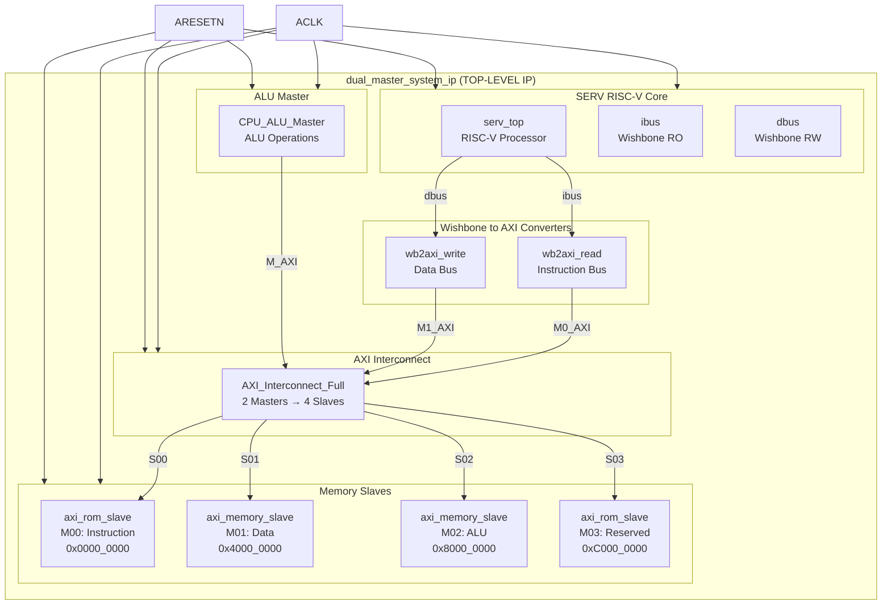

---

## 🔄 Luồng Dữ Liệu: SERV Instruction Fetch

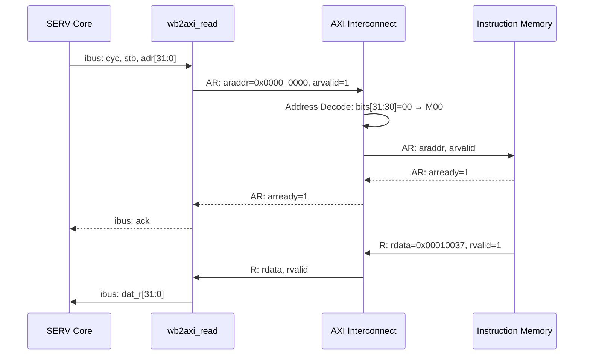

---

## 🔄 Luồng Dữ Liệu: SERV Data Write

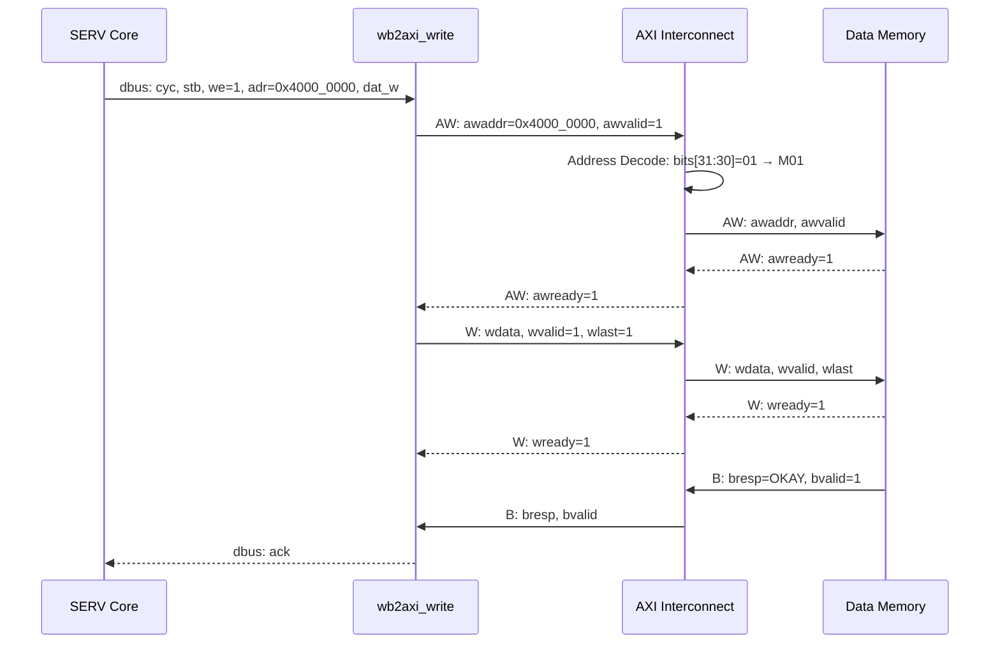

---

## 🔄 Luồng Dữ Liệu: ALU Master Operation

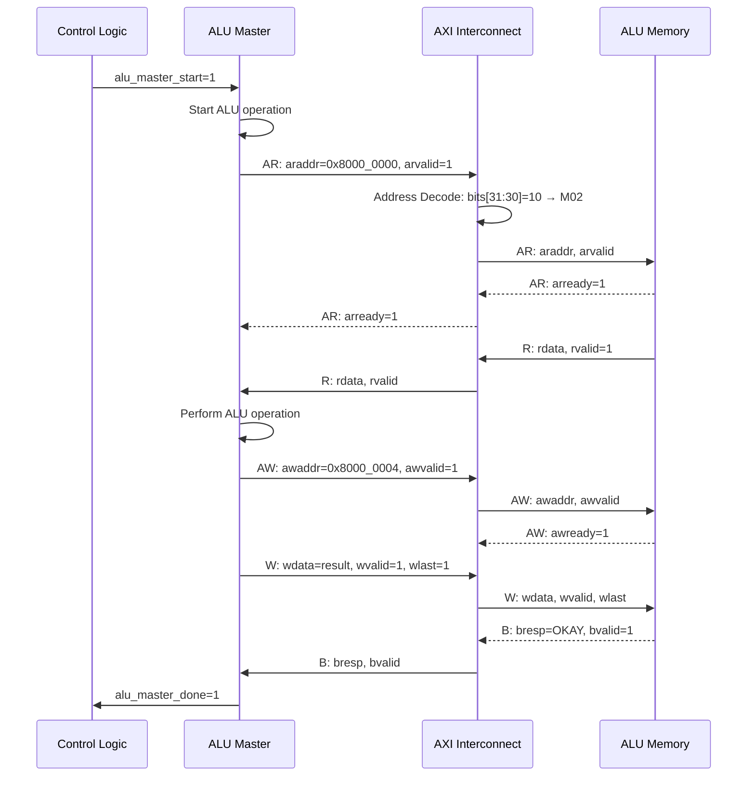

---

## 🗺️ Address Space Mapping

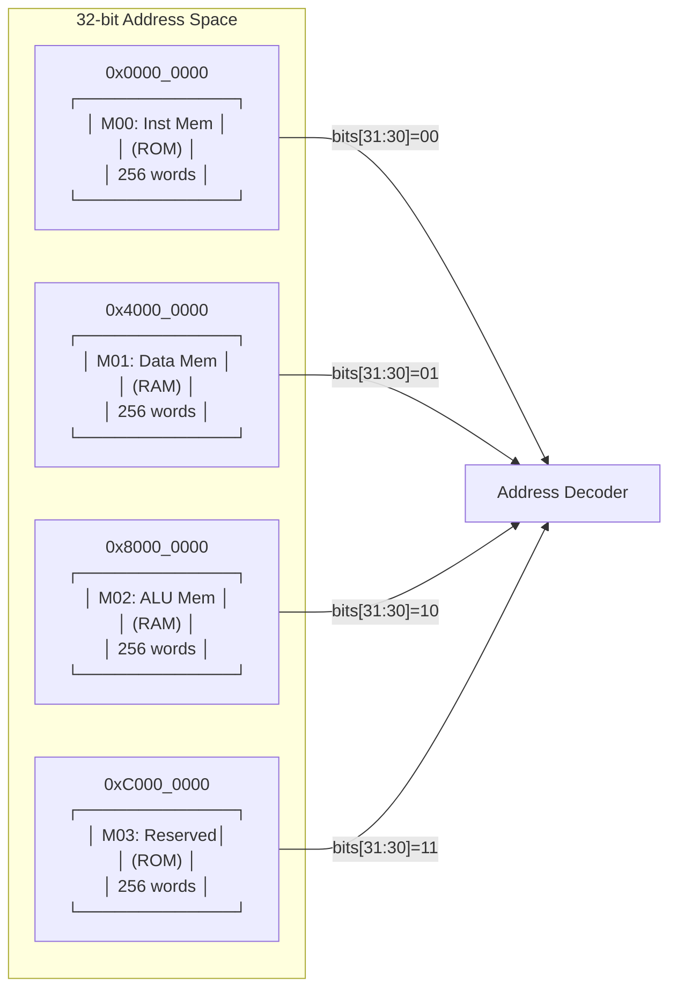

---

## 📊 Module Hierarchy Tree

```mermaid
graph TD
    TOP[dual_master_system_ip]
    
    TOP --> SERV_WRAP[serv_axi_wrapper]
    SERV_WRAP --> SERV_CORE[serv_top]
    SERV_CORE --> SERV_STATE[serv_state]
    SERV_CORE --> SERV_DEC[serv_decode]
    SERV_CORE --> SERV_ALU[serv_alu]
    SERV_CORE --> SERV_CTRL[serv_ctrl]
    SERV_CORE --> SERV_CSR[serv_csr]
    SERV_CORE --> SERV_MEM[serv_mem_if]
    SERV_CORE --> SERV_RF[serv_rf_top]
    
    SERV_WRAP --> WB_R[wb2axi_read]
    SERV_WRAP --> WB_W[wb2axi_write]
    
    TOP --> ALU_MASTER[CPU_ALU_Master]
    ALU_MASTER --> ALU_CORE[ALU_Core]
    ALU_MASTER --> ALU_CTRL[CPU_Controller]
    
    TOP --> AXI_IC[AXI_Interconnect_Full]
    AXI_IC --> AW_DEC[Write_Addr_Channel_Dec]
    AXI_IC --> AR_DEC[Read_Addr_Channel_Dec]
    AXI_IC --> W_ARB[Write_Arbiter]
    AXI_IC --> R_ARB[Read_Arbiter]
    AXI_IC --> AW_CTRL[AW_Channel_Controller_Top]
    AXI_IC --> WD_CTRL[WD_Channel_Controller_Top]
    AXI_IC --> BR_CTRL[BR_Channel_Controller_Top]
    AXI_IC --> AR_CTRL[AR_Channel_Controller_Top]
    
    TOP --> MEM0[axi_rom_slave M00]
    TOP --> MEM1[axi_memory_slave M01]
    TOP --> MEM2[axi_memory_slave M02]
    TOP --> MEM3[axi_rom_slave M03]
```

---

## 🔌 AXI Interconnect Internal Structure

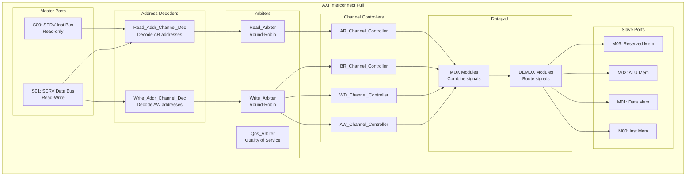

---

## 🎯 Testbench Architecture

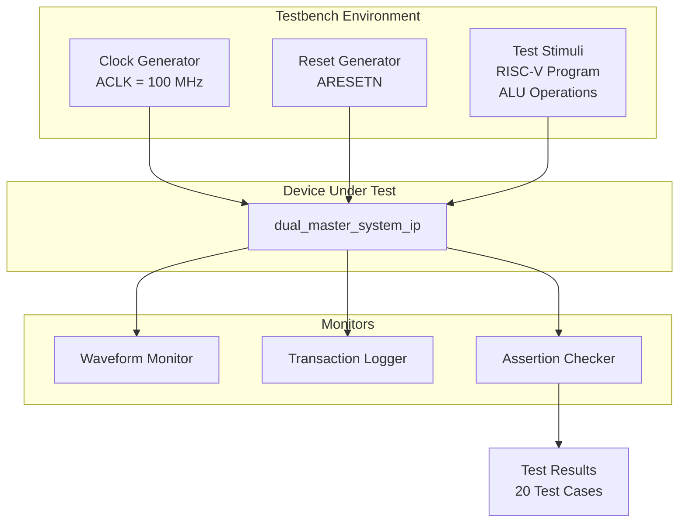

---

## 📈 Data Flow: Concurrent Operations

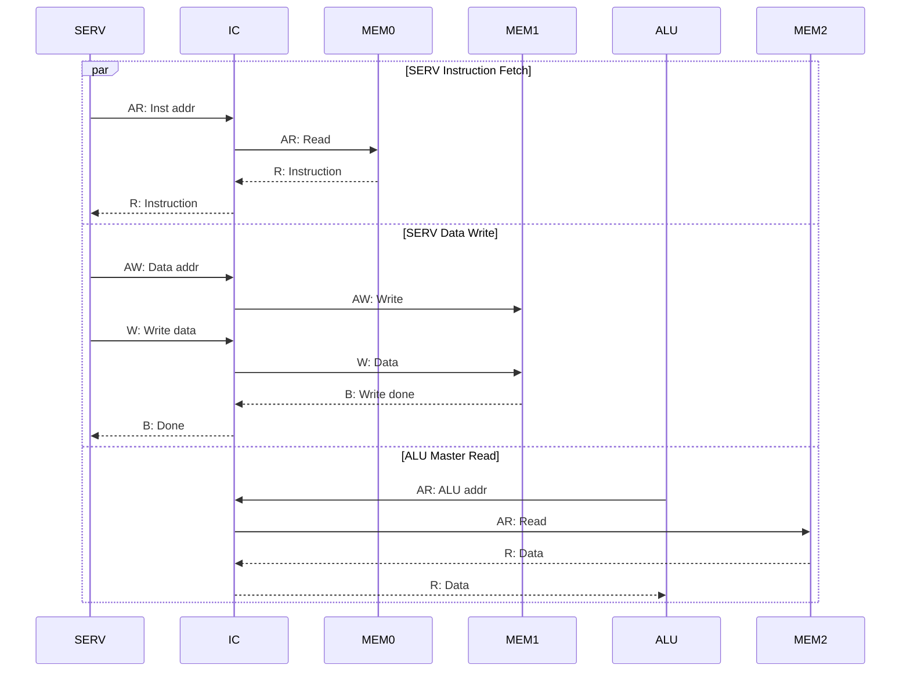

---

## 🔧 Component Details

### SERV RISC-V Core Components

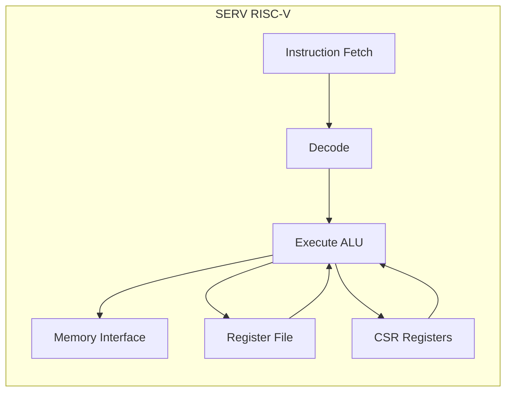

### ALU Master Components

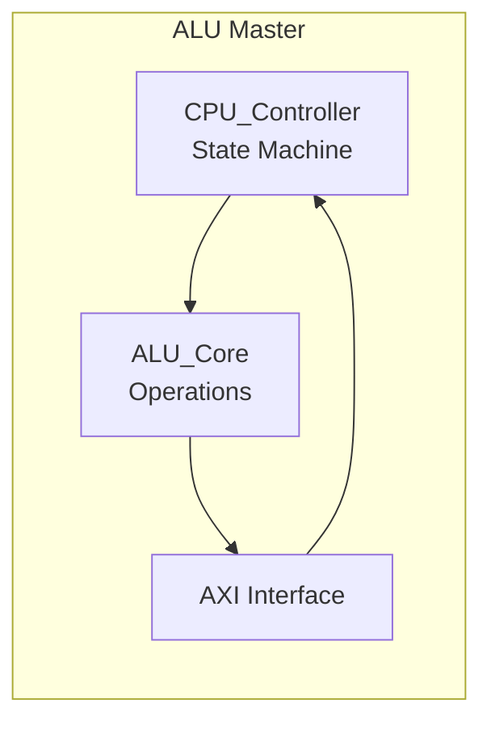

---

*Các sơ đồ Mermaid này có thể được render trong GitHub, GitLab, hoặc các markdown viewer hỗ trợ Mermaid.*

